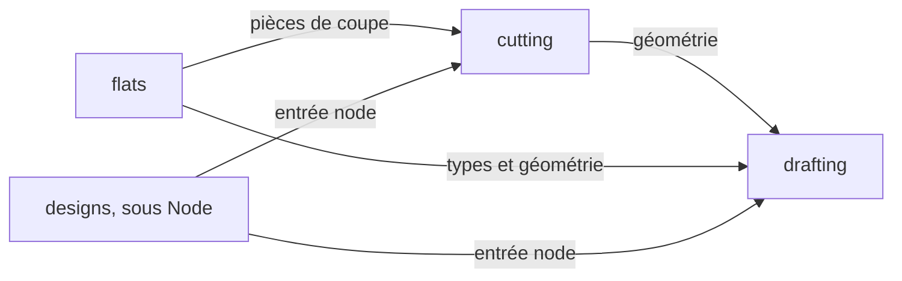

# 0024 — Dépendances entre moteurs TypeScript, et moteurs appelés par un service

**Contexte.** La règle des frontières entre projets (`@nx/enforce-module-boundaries`, `eslint.config.mjs` racine)
veut qu'un moteur (`type:engine`) n'importe que le noyau et les contrats, et qu'un service (`type:service`) n'importe
que le noyau, le `service-kit` et les contrats. Une seule exception existe : `engines/drape` importe
`@atelier/mannequin` depuis `src/body/` et ses tests (ADR 0013). Le lot 7 crée trois moteurs qui s'enchaînent
(ADR 0019 à 0021) : `drafting` trace la base et rejoue le document (FreeSewing, opérations, état rejoué,
GarmentSpec), `cutting` en tire les pièces de coupe, le plan de coupe et les exports, `flats` les dessins, les
planches et les textures ; `designs` valide et exporte avec les mêmes moteurs sous Node. Les tâches 1.57a, 1.58a,
1.58e, 1.59a, 1.59b, 1.60b et 1.60c du [lot 7](../suivi/lot-7.md) créent ces dépendances : elles sont fixées ici,
avant le code.

Constats sur la règle (Nx 23.2.1, ESLint 9.39.5 ; essais du 4 octobre 2026 sur des fichiers virtuels) :

- **Une exception se pose par ensemble de fichiers** : la configuration ESLint d'un projet redéclare la règle avec
  `boundaries(allow)`, exporté par la racine, pour quelques dossiers (modèle : `engines/drape/eslint.config.mjs`).
  La règle racine le permet telle qu'elle est écrite.
- **Chaque entrée de `allow` est une expression régulière non ancrée** : `'@atelier/drape'` laisse passer
  `@atelier/drape/node` et tout chemin qui contient ce texte ; ancrée, `'^@atelier/drafting/geometry$'` ne laisse
  passer que ce point d'entrée. Nx rattache bien un sous-chemin d'export à son projet, et le refuse s'il n'est pas
  permis.
- **Une importation permise échappe à tous les contrôles de la règle, cycles compris** ; un `import type` est
  contrôlé comme une importation de valeur.
- **Une configuration de projet qui reprend la racine (`...root`) évalue les motifs depuis le dossier du projet** :
  les motifs `**/…` restent valables, ceux des couches des services (`services/*/src/domain/**`,
  `services/*/src/application/**`) ne s'appliquent plus. Un `services/designs/eslint.config.mjs` écrit comme celui
  du drapé retirerait donc, sans aucune erreur, les règles du domaine et des cas d'usage.
- **Poids** ([essai de FreeSewing](../suivi/essai-freesewing.md)) : cœur, six modèles et mesures font 310 Ko
  (87 Ko gzip) ; la géométrie plane de l'essai tient en 8 Ko de source (`docs/suivi/essais/tuniques/geom.mjs`).

**Décision.**

- **La géométrie plane vit dans `drafting`**, sans nouveau paquet ni nouveau tag, et se publie par une troisième
  entrée, `@atelier/drafting/geometry` : code dans `src/core/geometry/`, entrée `src/geometry.ts`, export
  `"./geometry"` avec les conditions `source`, `types` et `default`, comme les entrées `.` et `./node` que crée le
  générateur de moteur (1.54c). Cette entrée est une **feuille** : elle n'atteint aucun paquet (ni FreeSewing, ni
  `@atelier/*`, ni `node:*`) et aucun fichier de `drafting` hors de `src/core/geometry/` ; un test sur le modèle de
  `test/browser-entry.test.ts` le vérifie (1.57a).
- **Les dépendances suivent le sens des données, sans cycle** (une flèche se lit « importe ») :



- `drafting` n'importe aucun moteur, pas même le mannequin : ses mesures lui arrivent complètes. Un document
  enregistré porte donc des mesures suffisantes pour sa base (taille d'un tableau, ou mesures complétées par le
  mannequin dans le studio) ; `designs` ne déduit rien, et un document incomplet est refusé par le rejeu (erreur
  typée). Le même document se rejoue ainsi à l'identique dans le navigateur et sous Node. `cutting` n'importe
  jamais `flats`, et aucun moteur n'importe un service.
- **Points d'entrée permis** ; toute autre importation d'un moteur reste refusée par la règle :

| Projet     | Fichiers                             | Peut importer                                                                 | Posé par     |
| ---------- | ------------------------------------ | ----------------------------------------------------------------------------- | ------------ |
| `drafting` | tous                                 | aucun moteur ; publie `@atelier/drafting/geometry`                            | 1.57a        |
| `cutting`  | `src/**`                             | `@atelier/drafting/geometry`                                                  | 1.58a        |
| `cutting`  | `test/**`                            | `@atelier/drafting/geometry`, `@atelier/drafting` (tracé de Brian, porte J1)  | 1.58a, 1.58e |
| `flats`    | `src/**`                             | `@atelier/drafting/geometry` ; `@atelier/drafting` en `import type` seulement | 1.59a        |
| `flats`    | `src/sheet/**`                       | en plus `@atelier/cutting` (pièces de coupe des planches)                     | 1.59b        |
| `flats`    | `test/**`                            | `@atelier/drafting`, `@atelier/drafting/geometry`, `@atelier/cutting`         | 1.59a, 1.59b |
| `designs`  | `src/adapters/engines/**`, `test/**` | `@atelier/drafting/node`, `@atelier/cutting/node`                             | 1.60b, 1.60c |

- **`flats` lit l'état rejoué comme une donnée** : l'état porte les régions, coutures, ornements et repères
  (1.57c, 1.57d) ; `flats` n'appelle aucune fonction de `drafting` hors de `./geometry`. Un `import type` disparaît à
  la compilation : `flats` n'embarque pas FreeSewing. Le type de l'état est une interface de `drafting` : le changer
  est un changement transverse (`drafting` puis `flats`).
- **`designs` passe par l'entrée `./node`**, celle des consommateurs Node (ADR 0021) : elle réexporte `.` et peut
  seule recevoir du code propre à Node (fichiers, fils de travail) sans toucher le studio. Son domaine et ses cas
  d'usage ne connaissent qu'un port typé par les contrats (document, GarmentSpec, pièces de coupe). Le studio et les
  modèles de vue (`type:app`, `type:feature`) importent déjà un moteur sans exception ; ils n'utilisent que `.` et, au
  besoin, `./geometry`.
- **Une exception de moteur se déclare dans son `eslint.config.mjs`** (créé par le générateur, qui n'importe que
  `root` : la tâche ajoute `boundaries`), avec des entrées ancrées et un commentaire qui cite cette ADR. `cutting`,
  après 1.58e :

```js
const { default: root, boundaries } = await import(
  new URL('../../eslint.config.mjs', import.meta.url).href
);

// ADR 0024 : de drafting, src/ n'importe que la géométrie ; les tests tracent et rejouent aussi.
const GEOMETRY = '^@atelier/drafting/geometry$';

export default [
  ...root,
  // Bloc du générateur (src/core pur), inchangé.
  {
    files: ['src/**/*.ts'],
    rules: { '@nx/enforce-module-boundaries': boundaries([GEOMETRY]) },
  },
  {
    files: ['test/**/*.ts'],
    rules: { '@nx/enforce-module-boundaries': boundaries([GEOMETRY, '^@atelier/drafting$']) },
  },
];
```

- `flats`, après 1.59b (même en-tête). La limite « types seulement », que Nx ne connaît pas, passe par
  `@typescript-eslint/no-restricted-imports` et non par `no-restricted-imports` : en configuration à plat, la
  dernière configuration d'une règle remplace les précédentes pour un fichier, et effacerait la règle de pureté de
  `src/core`.

```js
const DRAFTING = ['^@atelier/drafting$', '^@atelier/drafting/geometry$'];
const TYPES_ONLY =
  'flats lit l’état rejoué sans embarquer FreeSewing : import type seulement ; les fonctions viennent de @atelier/drafting/geometry (ADR 0024).';

export default [
  ...root,
  {
    files: ['src/**/*.ts'],
    rules: { '@nx/enforce-module-boundaries': boundaries(DRAFTING) },
  },
  {
    files: ['src/sheet/**/*.ts', 'test/**/*.ts'],
    rules: { '@nx/enforce-module-boundaries': boundaries([...DRAFTING, '^@atelier/cutting$']) },
  },
  {
    files: ['src/**/*.ts'],
    rules: {
      '@typescript-eslint/no-restricted-imports': [
        'error',
        { paths: [{ name: '@atelier/drafting', allowTypeImports: true, message: TYPES_ONLY }] },
      ],
    },
  },
];
```

- **L'exception de `designs` se déclare dans l'`eslint.config.mjs` racine**, par un bloc limité à ses adaptateurs
  de moteurs et à ses tests, placé après celui de `services/*/src/application` ; pas de
  `services/designs/eslint.config.mjs` (voir les constats). 1.60b le pose avec `drafting`, 1.60c y ajoute `cutting` :

```js
const designsEngines = {
  // ADR 0024 : designs calcule avec drafting et cutting, depuis ses seuls adaptateurs de moteurs.
  files: ['services/designs/src/adapters/engines/**/*.ts', 'services/designs/test/**/*.ts'],
  rules: {
    '@nx/enforce-module-boundaries': boundaries([
      '^@atelier/drafting/node$',
      '^@atelier/cutting/node$',
    ]),
  },
};
```

- **Déclaration des paquets** : `"@atelier/drafting": "workspace:*"` et `"@atelier/cutting": "workspace:*"` dans
  `dependencies` (pas `devDependencies`) de `cutting` (1.58a), `flats` (1.59a, 1.59b) et `designs` (1.60b, 1.60c).
  Pour `designs`, c'est ce qui les fait entrer dans son image (`pnpm deploy --prod` de son `Dockerfile`).
- **Versions** : changer un résultat de `./geometry` est un changement transverse, découpé par l'orchestrateur ; il
  relève l'`ENGINE_VERSION` de chaque moteur dont la sortie change (`drafting`, `cutting`, `flats`), et les
  références golden de `cutting` le détectent. Un résultat mis en cache par `designs` a pour clé, outre le document,
  la version de chaque moteur traversé (`drafting` et `cutting` pour un export).

**Solutions écartées.**

- **Un paquet partagé de géométrie** (`packages/geometry`) : il n'éviterait que l'exception de `cutting/src`, car
  `flats` dépend de toute façon de `drafting` (types de l'état rejoué) et les tests de `cutting` aussi (tracé,
  rejeu). Il coûterait un projet, un tag ou une exception de plus, un générateur de bibliothèque qui n'existe pas,
  une page de documentation et une version à reporter dans celles des moteurs. Il redevient utile si un consommateur
  hors de la chaîne 2D en a besoin (un service, `viewer3d`) ou si la géométrie doit évoluer à un autre rythme que
  `drafting` : déplacer `src/core/geometry/` et renommer l'import est alors mécanique.
- **La géométrie dans `@atelier/kernel`** : le noyau est importé par le domaine de chaque service et reste petit ;
  la géométrie des polylignes est un calcul de la chaîne 2D.
- **Une copie de la géométrie dans chaque moteur** : trois copies des mêmes décalages et découpes divergent, alors
  que c'est cette géométrie qui fait concorder patron, pièces de coupe et dessin.
- **Élargir la règle racine** (`type:engine` vers `type:engine`, `type:service` vers `type:engine`) : tout moteur
  pourrait importer tout autre, et tout fichier d'un service, domaine compris, un moteur, par n'importe quelle
  entrée, `./node` et FreeSewing compris.
- **`cutting` et `flats` importent la racine de `drafting`** : tout paquet du studio (Worker ou écran) qui les
  contient porterait FreeSewing (310 Ko, 87 Ko gzip) pour un simple décalage ; on ne compte pas sur l'élagage du
  paqueteur.
- **Le test de la porte J1 dans `drafting`** : `drafting` dépendrait de `cutting`, d'où un cycle ; dans les tests de
  `cutting`, la dépendance suit le sens des données.
- **L'exception de `designs` dans un `services/designs/eslint.config.mjs`** : possible en rebasant les blocs de la
  racine (`basePath`, ESLint 9.30 et suivants, essayé), mais un oubli retire en silence les règles des couches ; le
  bloc racine les garde par construction. En contrepartie, modifier la racine rend tous les projets « touchés »
  (`sharedGlobals` de `nx.json`), en 1.60b et en 1.60c.

**Conséquences.**

- Les tâches 1.60b et 1.60c modifient l'`eslint.config.mjs` racine (bloc de `designs`) : il entre dans leur
  périmètre. Le commentaire de `DEP_CONSTRAINTS` résume les exceptions et renvoie aux ADR 0013 et 0024.
- Absence de cycle : une importation permise n'est plus contrôlée pour les cycles ; l'absence de cycle tient donc à
  ce qu'aucune exception ne remonte la chaîne. `drafting` n'en déclare aucune ; une exception de `drafting` vers
  `cutting` ou `flats`, ou de `cutting` vers `flats`, est refusée en revue et demande une nouvelle ADR.
- Poids : FreeSewing reste dans le Worker de tracé du studio ; `cutting` et `flats` n'embarquent de `drafting` que
  `./geometry` (quelques Ko), et `flats` embarque `cutting`, sans FreeSewing puisque `cutting/src` n'importe que
  `./geometry`. Une règle racine `no-restricted-imports` interdisant `@atelier/*/node` dans `apps/*/src` et
  `packages/features/src` est à ajouter au lot 8 (avec 1.63, Worker du studio).
- Construction et tests : `typecheck` et `test` dépendent de `^build` (`nx.json`), et un consommateur lit le `dist`
  de `drafting` ; une configuration Vitest qui résout la condition `source` (comme `services/designs`) évite de
  tester contre un `dist` périmé hors de Nx.
- Sécurité : `designs` exécute FreeSewing dans son processus, à côté des secrets de sa base. Version épinglée exacte
  et fichier de verrouillage, aucun script d'installation (`onlyBuiltDependencies` ne le cite pas), montée de
  version en tâche séparée avec le banc des fiches (ADR 0019), conteneur sans droits root. Le document reçu n'est
  pas sûr : il est validé (schéma, bornes de taille) avant le rejeu ; ni document ni mesure (donnée personnelle)
  n'apparaît dans les journaux ni dans les erreurs relayées. Le schéma du document (1.54b) borne le nombre
  d'opérations et de points d'un chemin, sinon un document peut bloquer la boucle d'événements du service ; un
  calcul qui dépasse son budget passe dans un fil de travail (décision en 1.60c, sur mesures).
- Image de `designs` : `drafting`, `cutting` et FreeSewing (avec ses `packageExtensions`) y entrent par
  `pnpm deploy --prod` ; à vérifier par `pnpm stack:up` dès 1.60b.
- L'exception de `engines/drape` (`'@atelier/mannequin'`, non ancrée) laisse aussi passer `@atelier/mannequin/…` :
  elle s'ancre (`'^@atelier/mannequin$'`) à la prochaine tâche qui touche le drapé (1.71).
