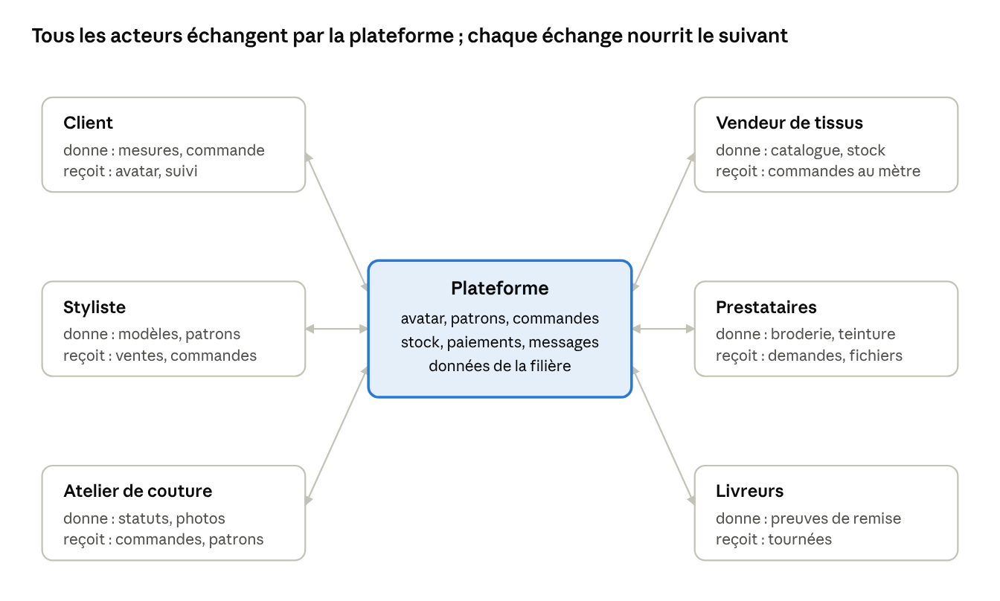

# 3. Acteurs et applications clientes

Un même compte porte plusieurs rôles ; les droits dépendent du rôle tenu dans chaque atelier.

| Acteur                           | Rôles possibles                                                           | Application principale                    | Besoins clés                                                                                                             |
| -------------------------------- | ------------------------------------------------------------------------- | ----------------------------------------- | ------------------------------------------------------------------------------------------------------------------------ |
| Client                           | client                                                                    | Application mobile + web                  | Mesures et avatar, commande, suivi, matières confiées, messagerie, paiement                                              |
| Styliste                         | créateur                                                                  | Studio web (ordinateur, tablette)         | Atelier virtuel 2D / 2,5D / 3D, patrons, choix des tissus, publication, collaboration                                    |
| Couturier propriétaire           | propriétaire d'atelier                                                    | Application mobile + web                  | Employés, registre clients, commandes, attribution, caisse, achats de tissu, vitrine                                     |
| Employé d'atelier                | chef d'atelier, coupeur, couturier, brodeur, repasseur, livreur, caissier | Application mobile (mode tâches)          | Tâches du jour, fiche technique, patron, photos d'avancement                                                             |
| Vendeur de tissus et de mercerie | propriétaire, vendeur, magasinier                                         | Application mobile + web (espace vendeur) | Catalogue numérisé, stock par boutique et par rouleau, partage du catalogue, commandes au mètre, réservations, livraison |
| Prestataire spécialisé           | brodeur machine, teinturier, imprimeur textile, plisseur                  | Application mobile + web                  | Demandes avec fichiers (motif, couleur, métrage), devis, planning, remise                                                |
| Livreur partenaire               | coursier                                                                  | Application mobile (mode tournée)         | Tournées, retraits chez les vendeurs, preuves de remise                                                                  |
| Marque ou confectionneur         | responsable produit, production                                           | Studio web + API                          | Collections, gradation, séries, achats de tissu en volume                                                                |
| Administrateur                   | modérateur, support, finance                                              | Back-office web                           | Modération, litiges, abonnements, suivi technique                                                                        |
| Boutique partenaire              | intégrateur                                                               | Widget JavaScript + API                   | Avatar et patron à la commande sur un site tiers                                                                         |

**Applications**

- **Application mobile** (Android d'abord, iOS ensuite) : mode client et mode atelier dans la même application, base locale synchronisée, notes vocales, photos, lecture des QR codes des tickets.
- **Application web** : mêmes espaces qu'en mobile, plus le studio de création qui a besoin d'un grand écran.
- **Studio de création** : module web lourd (three.js ou WebGPU) chargé à la demande ; il parle aux moteurs par l'API et reçoit les résultats en temps réel.
- **Back-office** : outil interne, accès restreint et journalisé.
- **Widget partenaire** : script léger à intégrer sur un site marchand, qui ouvre le parcours avatar et commande.

**La boucle de la filière**

Le client commande un modèle ; l'atelier reçoit le patron et le métrage calculé ; le vendeur de tissus reçoit la commande au mètre ; le prestataire reçoit le fichier de broderie ; le livreur ferme la boucle, et l'avis du client revient au styliste, à l'atelier et au vendeur.
