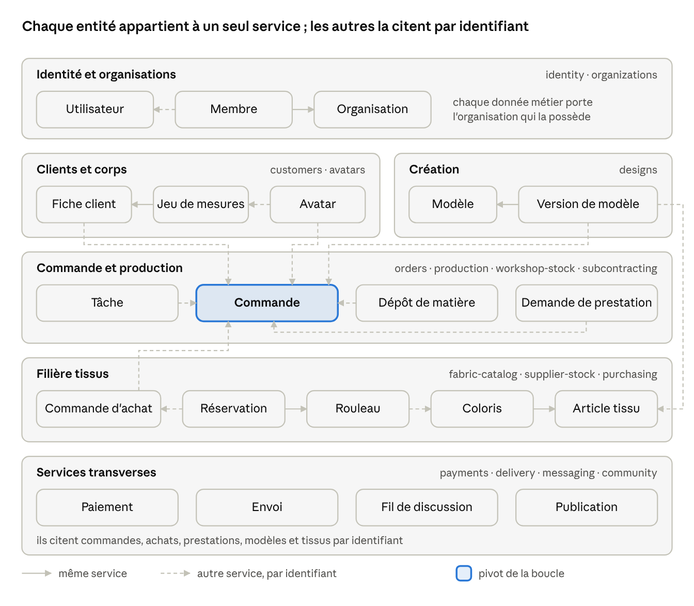

# 7. Données, stockage et formats

Les données métier vivent dans PostgreSQL (un schéma par service, isolation par atelier), les fichiers dans un stockage objet, et chaque objet de conception est versionné sans jamais être écrasé.

**Modèle conceptuel**

La Commande relie le client, son avatar et la version figée du modèle ; la Commande d'achat la relie à la filière tissus. Une flèche en pointillé traverse une frontière de service : l'entité ne garde que l'identifiant de l'autre, et une copie des champs utiles alimentée par ses événements.

**Entités principales**

| Entité                | Champs essentiels                                                                                            | Relations                                                                                                      |
| --------------------- | ------------------------------------------------------------------------------------------------------------ | -------------------------------------------------------------------------------------------------------------- |
| Utilisateur           | téléphone, nom, langue, rôles                                                                                | possède des Fiches client, est Membre d'Organisations                                                          |
| Organisation          | type (atelier, boutique de tissus, prestataire, livreur, marque), nom, ville, paramètres, abonnement         | a des Membres, une Vitrine ; un atelier a des Commandes, une boutique a des Articles tissu et des Rouleaux     |
| Membre                | rôle, compétences, statut                                                                                    | relie Utilisateur et Organisation                                                                              |
| Fiche client          | identité, préférences, consentements                                                                         | a des Jeux de mesures, des Commandes                                                                           |
| Jeu de mesures        | date, méthode (mètre, photo, scan), auteur, valeurs ISO 8559-1                                               | produit un Avatar                                                                                              |
| Avatar                | paramètres du mannequin, fichier glTF, écarts obtenus                                                        | sert au Drapé et au Rendu                                                                                      |
| Modèle                | auteur, licence, composants                                                                                  | a des Versions                                                                                                 |
| Version de modèle     | paramètres, spécification de patron, tissus choisis et métrages, empreinte                                   | a des Drapés, des Exports                                                                                      |
| Commande              | client, atelier, modèle figé, prix, dates promises                                                           | a des Étapes, des Tâches, des Paiements, des Dépôts, des Commandes d'achat, des Demandes de prestation, un Fil |
| Tâche                 | type, employé, durée, photos                                                                                 | appartient à une Étape                                                                                         |
| Dépôt de matière      | photo, métrage, état, restitution                                                                            | lié à une Commande                                                                                             |
| Article tissu         | boutique, référence, composition, grammage, laize, prix au mètre, tissu numérique (texture, propriétés, U3M) | a des Coloris ; cité par les Versions de modèle                                                                |
| Coloris               | nom, couleur mesurée, photos                                                                                 | appartient à un Article tissu, a des Rouleaux                                                                  |
| Rouleau               | lot, bain de teinture, métrage restant, emplacement                                                          | appartient à un Coloris, porte des Réservations                                                                |
| Réservation           | métrage, échéance, statut                                                                                    | relie un Rouleau et une Commande d'achat                                                                       |
| Commande d'achat      | acheteur (atelier ou client), boutique, lignes au mètre, métrage coupé, retrait ou livraison, statut         | a des Réservations, des Paiements, une Livraison ; liée à une Commande                                         |
| Demande de prestation | prestataire, type (broderie, teinture, impression, plissé), fichiers, métrage, prix, délai                   | liée à une Commande, a des Paiements                                                                           |
| Paiement              | montant, moyen, référence agrégateur, bénéficiaire                                                           | lié à une Commande, une Commande d'achat, une Demande de prestation ou une Vente                               |
| Publication           | modèle ou tissu, visuels, licence, avis                                                                      | appartient à la Communauté                                                                                     |

**Stockage**

- **PostgreSQL** : données métier, avec cloisonnement par atelier (sécurité au niveau des lignes).
  Exception : la table `outbox` de chaque service n'est pas cloisonnée, car son relais publie les événements
  de tous les ateliers. En contrepartie, `outbox.data` ne contient que des identifiants, empreintes et
  versions, jamais de mesure ni de donnée personnelle ; un rôle PostgreSQL dédié au relais viendra avec
  le service Identité.
- **Stockage objet** (compatible S3) : photos, glTF, PDF, DXF, rendus ; accès par URL signées et limitées dans le temps ; CDN devant les fichiers publics.
- **Cache** (Valkey) : sessions, résultats des moteurs par empreinte, limites de débit.
- **Recherche** : index des modèles, ateliers et clients (OpenSearch, ou PostgreSQL pour commencer).
- **Entrepôt analytique** : événements anonymisés pour les statistiques et l'apprentissage.

**Formats d'échange et normes**

| Domaine                           | Format ou norme                                                            | Usage                                                                                      |
| --------------------------------- | -------------------------------------------------------------------------- | ------------------------------------------------------------------------------------------ |
| Mesures du corps                  | ISO 8559-1 à 3, EN 13402                                                   | Noms, méthodes de mesure, tailles                                                          |
| Corps virtuel                     | ISO 18825-1 et 2                                                           | Repères et dimensions de l'avatar                                                          |
| Scan 3D                           | ISO 20685                                                                  | Qualité des mesures par scan                                                               |
| Patron                            | Spécification GarmentCode étendue (JSON)                                   | Format pivot interne                                                                       |
| Patron (sortie)                   | DXF-AAMA / ASTM D6673, PDF, SVG                                            | Tables de coupe, impression                                                                |
| 3D                                | glTF 2.0                                                                   | Avatar, vêtement drapé, échanges avec CLO, Style3D, Blender                                |
| Tissu numérique                   | U3M, AxF                                                                   | Texture, couleur et propriétés physiques des tissus, échanges avec CLO, Style3D, Browzwear |
| Articles et factures fournisseurs | Codes GTIN (GS1) quand le vendeur en a, facture électronique selon le pays | Identifier les articles, facturer les achats au mètre                                      |
| Produit (export UE)               | Passeport numérique produit (ESPR)                                         | Matières, origine, entretien, vers 2027-2028                                               |
