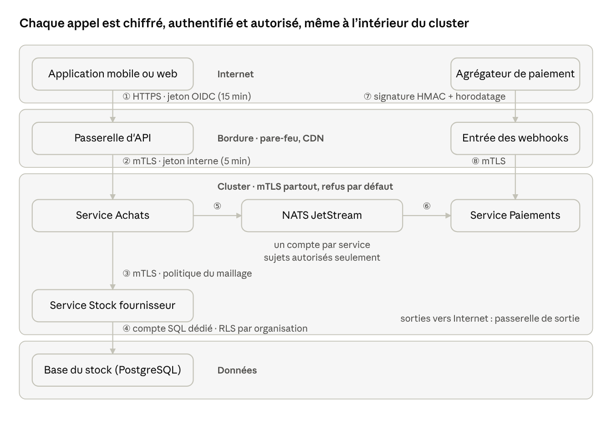

# 10. Communication et sécurité entre services

Aucun service ne fait confiance au réseau : chaque appel est chiffré et authentifié des deux côtés, porte l'identité de l'utilisateur d'origine, et n'aboutit que si une règle l'autorise explicitement (zéro confiance, refus par défaut). Les services écrivent très peu de code pour cela : le maillage, la passerelle et `service-kit` portent ces contrôles.

## 10.1 Parcours d'une requête

1. L'application appelle la passerelle en HTTPS avec son jeton OIDC ; le pare-feu et la limite de débit filtrent en amont.
2. La passerelle vérifie le jeton, l'échange contre un jeton interne de 5 minutes, puis appelle Achats dans le maillage (mTLS).
3. Achats appelle Stock fournisseur pour réserver le métrage : le maillage vérifie que cet appel est déclaré, Stock vérifie le jeton et la règle métier.
4. Stock écrit avec son propre compte SQL ; la sécurité au niveau des lignes limite l'accès à l'organisation du jeton.
5. Achats publie `purchase.placed` avec son compte NATS, qui ne peut publier que sur `purchase.>`.
6. Paiements reçoit l'événement parce que son abonnement est déclaré dans le contrat, et revérifie l'organisation avant d'agir.
7. L'agrégateur de mobile money confirme le paiement par un webhook ; l'entrée des webhooks vérifie la signature et l'horodatage.
8. Le webhook passe à Paiements dans le maillage ; Paiements confirme le statut auprès de l'agrégateur, par la passerelle de sortie, avant de valider.

## 10.2 Canaux et garanties

| Canal                      | Transport                     | Qui est authentifié                                                         | Autorisation                                                              | Livraison                                                     |
| -------------------------- | ----------------------------- | --------------------------------------------------------------------------- | ------------------------------------------------------------------------- | ------------------------------------------------------------- |
| Appel HTTP entre services  | HTTP/2 dans le maillage, mTLS | Le service appelant (certificat) et l'utilisateur d'origine (jeton interne) | Politique du maillage, puis règle métier dans le cas d'usage              | Délai, reprise si l'appel est idempotent, disjoncteur         |
| Événement (NATS JetStream) | TLS                           | Le service éditeur (identifiants NATS propres)                              | Permissions par sujet : publier ses sujets, s'abonner aux sujets déclarés | Au moins une fois, consommateurs idempotents, file des rejets |
| Tâche de calcul            | TLS, file NATS                | Le service demandeur, puis le moteur                                        | Une file par moteur, seuls les services autorisés y déposent              | Reprise bornée, résultat annoncé par un événement             |
| Fichier (glTF, PDF, photo) | HTTPS vers le stockage objet  | Le porteur d'une URL signée                                                 | Un seul objet, en lecture ou en écriture, pendant quelques minutes        | —                                                             |

## 10.3 Identité : quel service, pour le compte de qui

- **Identité des services** : le maillage de services (Istio en mode ambient) donne à chaque service un certificat lié à son compte de service Kubernetes, valable 24 heures et renouvelé automatiquement. Tout le trafic interne est chiffré et authentifié des deux côtés (mTLS), sans code dans les services.
- **Identité de l'utilisateur** : la passerelle vérifie le jeton OIDC de l'application (15 minutes), puis l'échange contre un jeton interne signé par le service Identité (échange de jetons, RFC 8693). Ce jeton porte l'utilisateur, l'organisation, les rôles, le service destinataire et la chaîne des services traversés ; il vit 5 minutes. Le jeton externe ne dépasse jamais la passerelle.
- **Vérification locale** : chaque service vérifie la signature du jeton interne avec les clés publiques du service Identité, gardées en cache ; aucun appel à Identité par requête.
- **Travail sans utilisateur** (consommateur d'événement, tâche planifiée) : jeton de service à portée minimale. L'événement transporte l'organisation et l'auteur de l'action d'origine, que le consommateur revérifie avant d'agir.
- **Aucun en-tête de confiance** : un en-tête `X-User-Id` ou `X-Org-Id` non signé est ignoré, même s'il vient de l'intérieur du cluster.

## 10.4 Autorisation à quatre niveaux, refus par défaut

| Niveau            | Règle                                                                                                                                                                                            | Outil                                                   |
| ----------------- | ------------------------------------------------------------------------------------------------------------------------------------------------------------------------------------------------ | ------------------------------------------------------- |
| Réseau            | Tout trafic refusé sauf celui du maillage ; sorties vers Internet uniquement par une passerelle de sortie, vers une liste de destinations (agrégateurs de paiement, WhatsApp, fournisseurs d'IA) | Politiques réseau Kubernetes, passerelle de sortie      |
| Service à service | Un service n'appelle que les services déclarés dans son manifeste ; les politiques sont générées depuis ces déclarations et les contrats                                                         | Politiques d'autorisation du maillage                   |
| Métier            | Rôle, organisation et propriété vérifiés dans chaque cas d'usage (seul un membre de la boutique confirme une coupe)                                                                              | Module de politiques du service, testé comme le domaine |
| Données           | Chaque service a son propre compte SQL, limité à son schéma ; sécurité au niveau des lignes par organisation                                                                                     | PostgreSQL                                              |

## 10.5 Événements sûrs

- **Comptes NATS** : un utilisateur par service, qui ne peut publier que sur ses propres sujets (`purchase.>` pour Achats) et ne s'abonner qu'aux sujets listés dans le contrat AsyncAPI ; ces permissions sont générées depuis les contrats.
- **Contenu minimal** : identifiants et faits, jamais de mesure, de téléphone ni de photo. Un consommateur qui a besoin de plus appelle l'API du service propriétaire, avec ses propres droits.
- **Validation** : chaque message est vérifié par son schéma à la réception ; un message invalide part dans la file des rejets et déclenche une alerte.
- **Doublons et désordre** : le consommateur mémorise les identifiants déjà traités ; l'événement porte la version de l'entité, et un événement plus ancien que l'état connu est ignoré.
- **Conservation** : durée bornée par sujet, assez longue pour rejouer les événements après un incident.

## 10.6 Fiabilité des échanges

- **Délais** : chaque requête porte une échéance, et chaque saut s'accorde moins que le temps restant. Par défaut : 2 s entre services, 1 s vers les moteurs rapides.
- **Reprises** : seulement pour un appel idempotent (lecture, ou écriture avec `Idempotency-Key`), deux au plus, avec une attente croissante et une part aléatoire. Elles sont faites à un seul endroit, le maillage, jamais aussi dans le code : deux couches de reprises multiplient la charge pendant une panne.
- **Disjoncteur et cloisons** : un pool de connexions par dépendance, coupé quand elle échoue en série ; un service lent ne bloque pas les autres.
- **Mode dégradé** : si un service répond mal, on affiche la dernière valeur connue marquée « à confirmer » (un stock, par exemple) ou on met la demande en file, plutôt qu'une erreur.
- **Transactions entre services** : pas de transaction distribuée, mais des sagas. Chaque étape est idempotente, a une échéance et une action de compensation ; l'état de la saga est gardé dans la base du service qui l'orchestre.

| Étape de la saga « achat au mètre » (orchestrée par Achats) | Service           | Compensation si une étape suivante échoue  |
| ----------------------------------------------------------- | ----------------- | ------------------------------------------ |
| 1. Réserver le métrage sur un rouleau                       | Stock fournisseur | Libérer la réservation                     |
| 2. Encaisser le paiement                                    | Paiements         | Rembourser                                 |
| 3. Confirmer la commande au vendeur                         | Achats            | Annuler la commande et prévenir le vendeur |
| 4. Programmer le retrait ou la livraison                    | Livraison         | Annuler l'envoi                            |

## 10.7 Secrets, clés et webhooks

- **Secrets** : dans le gestionnaire de secrets du cloud, injectés au démarrage ; rien dans le dépôt ni dans les images.
- **Bases de données** : identifiants à durée de vie courte, générés à la demande et renouvelés automatiquement, un compte par service.
- **Clés de signature des jetons internes** : rotation régulière, avec l'ancienne et la nouvelle clé publiées ensemble pendant la transition (identifiant de clé dans chaque jeton).
- **Certificats du maillage** : autorité racine gardée hors du cluster, autorité intermédiaire renouvelée, certificats de service de 24 heures.
- **Webhooks entrants** (agrégateurs de mobile money, WhatsApp) : point d'entrée dédié à la bordure ; signature HMAC vérifiée avec un horodatage récent ; traitement idempotent par identifiant de transaction. Un paiement n'est validé qu'après confirmation de son statut auprès de l'agrégateur.

## 10.8 Surveillance et contrôle

- **Traces** : le contexte de trace W3C passe dans les en-têtes HTTP et NATS ; le parcours complet d'une commande, d'un service à l'autre, est visible d'un coup.
- **Métriques par paire de services** fournies par le maillage : taux de succès, latence, volume.
- **Alertes** : refus d'autorisation en hausse, message en file des rejets, certificat ou clé proche de l'expiration, tentative de sortie vers une destination non listée.
- **Audit** : chaque accès aux mesures et aux paiements est journalisé avec la chaîne des services traversés, lue dans le jeton interne.
- **Tests** : l'intégration continue vérifie qu'un appel non déclaré est refusé et qu'un sujet NATS non autorisé est bloqué ; la rotation des clés est répétée en recette.
