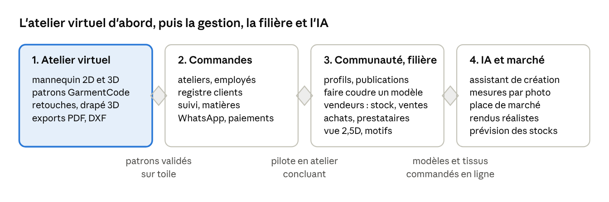

# 14. Mise en œuvre par étapes et risques

La première phase livre l'objectif immédiat : une interface simple pour obtenir les patrons, les modifier et les voir sur un mannequin 2D et 3D ; chaque phase suivante ne démarre qu'une fois sa porte franchie.

La phase 1 réutilise le mannequin déjà prototypé et la bibliothèque GarmentCode ; la phase 2 rejoint le niveau des applications de gestion déjà présentes sur le marché ; la phase 3 ouvre la plateforme aux vendeurs de tissus et aux prestataires (catalogue, stock, commandes au mètre, sous-traitance) et ferme la boucle de la filière ; les phases 3 et 4 portent la différence.

**Risques principaux**

| Risque                               | Effet                                              | Parade                                                                                                                                                                                |
| ------------------------------------ | -------------------------------------------------- | ------------------------------------------------------------------------------------------------------------------------------------------------------------------------------------- |
| Périmètre trop large                 | Rien n'est fini à temps                            | Livrer phase par phase, chaque porte vérifiée                                                                                                                                         |
| Qualité de coupe des patrons de base | Toiles ratées, perte de confiance des ateliers     | Modéliste dans l'équipe, toiles d'essai, retours d'essayage                                                                                                                           |
| Licences de composants tiers         | Blocage juridique en production                    | Registre des licences, validation avant intégration (poids d'IA, maillage, cache), revue annuelle des licences                                                                        |
| Coût et disponibilité des GPU        | Drapés lents ou chers                              | Cache par empreinte, arrêt automatique des workers, aperçu 2D / 2,5D immédiat                                                                                                         |
| Téléphones modestes et réseau faible | Studio 3D inutilisable                             | Vue 2,5D, calcul local du mannequin et du patron, mode hors-ligne                                                                                                                     |
| Adoption par les tailleurs           | Peu d'usage réel                                   | Parcours très simples, notes vocales, langues locales, accompagnement du pilote                                                                                                       |
| Données corporelles sensibles        | Atteinte à la vie privée, sanctions                | Consentement, chiffrement, accès tracés, IA auto-hébergée pour les photos                                                                                                             |
| Adoption par les vendeurs de tissus  | Catalogue vide, boucle ouverte                     | Fiche tissu par photo et note vocale, import de tableur, stock simplifié (métrage par rouleau), commandes reçues sur WhatsApp, premières commandes apportées par les ateliers pilotes |
| Stock affiché faux                   | Commandes impossibles à servir, perte de confiance | Réservation limitée dans le temps, confirmation de coupe par le vendeur, ajustement du stock en un geste, fiabilité du vendeur visible                                                |
| Qualité des fiches tissus            | Couleur ou tombé trompeurs, litiges                | Mire obligatoire, validation par le vendeur, mention « estimé », avis sur le tissu reçu                                                                                               |
