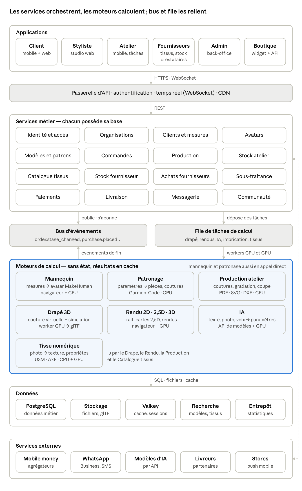
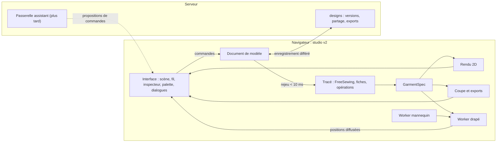

# 2. Diagramme global du système

Les applications passent toutes par la passerelle ; les services métier appellent directement les moteurs rapides (mannequin, patronage) et confient le calcul lourd à la file ; la fin de chaque tâche revient par le bus d'événements. Les services Paiements, Messagerie et le moteur IA sont les seuls à parler aux services externes (flèche pointillée). Les vendeurs de tissus et les prestataires ont leur propre application, branchée sur les mêmes services : leur stock, leurs ventes et leurs prestations passent par les mêmes événements que les commandes des ateliers, et le moteur Tissu numérique rend leurs tissus visibles sur le patron et sur le mannequin.

## 2.1 Le studio, cible de la phase 1

Le schéma ci-dessus reste le cadre de la plateforme complète. Pour la phase 1, le calcul interactif quitte les
services et les moteurs du serveur pour le navigateur ([ADR 0021](../adr/0021-studio-local-et-refonte-des-moteurs.md)) :
le document de modèle est rejoué à chaque geste, les dessins et les patrons suivent en quelques millisecondes, le
drapé tourne dans un Worker ; le service `designs` enregistre les versions et produit les exports à la demande avec
les mêmes moteurs sous Node.

