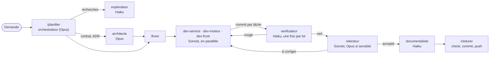

# Orchestration des agents

Le dépôt se développe en grande partie avec Claude Code. Pour tenir la qualité sans payer le prix fort à chaque
ligne, le travail est réparti entre trois modèles : **Opus décide et contrôle, Sonnet construit, Haiku exécute
et rapporte**. La décision est dans l'[ADR 0007](../adr/0007-orchestration-des-modeles.md) ; les règles que
Claude Code charge automatiquement sont dans `CLAUDE.md`.

## Les fichiers

| Fichier                       | Rôle                                                                                         |
| ----------------------------- | -------------------------------------------------------------------------------------------- |
| `AGENTS.md`                   | Règles de code communes à tous les outils et aux humains (inclus par `CLAUDE.md`)            |
| `CLAUDE.md`                   | Rôle de l'orchestrateur, répartition, escalade, parallélisme, fiche de tâche, compte rendu   |
| `.claude/agents/*.md`         | Les huit sous-agents : modèle, outils, périmètre, méthode, interdits                         |
| `.claude/skills/*/SKILL.md`   | Le cycle : `/planifier`, `/livrer`, `/cloturer`, et `/reprendre` après une interruption      |
| `.claude/lot-en-cours.md`     | État du lot en cours (tâches, statuts, fiches, décisions), ignoré par git                    |
| `.claude/settings.json`       | Permissions partagées : commandes de vérification autorisées, fichiers protégés, push bornés |
| `.claude/settings.local.json` | Réglages personnels, ignorés par git                                                         |

## Répartition

| Agent            | Modèle | Rôle                                                                           | Écrit dans                              |
| ---------------- | ------ | ------------------------------------------------------------------------------ | --------------------------------------- |
| `architecte`     | Opus   | Contrats, ADR, choix d'une approche, décisions transverses                     | `contracts/`, `docs/adr/`               |
| `relecteur`      | Sonnet | Revue d'un lot contre les directives ; Opus pour les cas sensibles             | rien (rapport)                          |
| `dev-service`    | Sonnet | Une tâche dans un microservice                                                 | `services/<un seul>`                    |
| `dev-moteur`     | Sonnet | Une tâche dans un moteur de calcul                                             | `engines/<un seul>`                     |
| `dev-front`      | Sonnet | Modèles de vue, composants, écrans                                             | `packages/features`, `ui-web`, `apps/*` |
| `explorateur`    | Haiku  | Trouver où est quoi, résumer du code, lire des journaux                        | rien (rapport)                          |
| `verificateur`   | Haiku  | Lancer lint, types, tests, construction ; rapporter les échecs `fichier:ligne` | rien (rapport)                          |
| `documentaliste` | Haiku  | Changelog, tableau des travaux, pages `docs/`, `AGENTS.md` après un changement | `docs/`, `CHANGELOG.md`, `AGENTS.md`    |

Pourquoi ce partage : le coût d'une erreur de conception (un contrat mal découpé, une faille) dépasse de loin le
prix d'Opus, qui ne sert donc qu'à décider et à relire les cas sensibles (contrat, sécurité, données sensibles,
migration, golden). Le code de routine, bien borné par une fiche et vérifié par
les tests, est à la portée de Sonnet. Les tâches mécaniques et volumineuses (chercher, lancer des commandes,
mettre à jour la documentation) vont à Haiku, le moins cher et le plus rapide.

## Le cycle d'un lot de travail



1. **`/planifier`** (dans la session principale) : l'orchestrateur reformule la demande, fait explorer si
   besoin, confie à `architecte` un contrat, une ADR ou un choix d'approche, puis découpe lui-même en tâches d'une
   demande de fusion chacune ; il les inscrit au [tableau des travaux](../suivi/travaux.md) et dans
   `.claude/lot-en-cours.md`.
2. **`/livrer`** : le contrat d'abord, seul ; puis les tâches indépendantes partent en parallèle vers les agents
   Sonnet, et chaque tâche contrôlée est commitée en local ; ensuite, une fois pour le lot, `verificateur` lance
   `pnpm check:affected`, `relecteur` relit les fichiers du lot et `documentaliste` met à jour le changelog, le
   tableau et les pages concernées.
3. **`/cloturer`** : `pnpm check` complet, commit au format Conventional Commits, push sur la branche de travail
   (le hook `pre-push` revérifie).

## Lancer une session

```text
/model opus                         # la session principale orchestre
/planifier ajouter la jupe trapèze au moteur de patronage et au studio
/clear                              # plan de plus de trois tâches : il est dans le fichier d'état
/livrer                             # exécute le plan validé
/cloturer                           # vérifie, commite, pousse
/clear                              # avant le lot suivant
/reprendre                          # dans une session neuve, après une interruption
```

Une petite demande (une question, une correction d'une ligne) se traite directement, sans délégation. On peut
aussi appeler un agent précis : « demande à `explorateur` où est calculée l'aisance ».

## Fiche de tâche et compte rendu

Un sous-agent ne voit pas la conversation : tout ce qu'il doit savoir est dans sa fiche. Modèle (dans
`CLAUDE.md`) :

```markdown
Tâche : 1.xx (exemple) — Jupe trapèze dans le moteur de patronage
Objectif : POST /v1/patterns rend un patron de jupe trapèze pour le style « a-line ».
Périmètre : engines/patterning ; tout le reste en lecture seule.
Contexte : core/garments/straight_skirt.py (modèle à suivre), contracts/schemas/garment-request.schema.json
(déjà à jour).
Critères d'acceptation : ourlet plus large que la hanche ; longueurs cohérentes aux coutures ; golden ajouté.
Hors périmètre : studio, contrats, autres moteurs.
Vérification : pnpm nx run patterning:test
Compte rendu attendu : format « Compte rendu ».
```

Chaque agent termine par un compte rendu court que l'orchestrateur contrôle avant d'enchaîner :

```markdown
## Compte rendu

- Fait : …
- Fichiers modifiés : …
- Tests ajoutés : …
- Vérification : commande lancée et résultat
- Points ouverts : … (ou « aucun »)
```

La rubrique « Contexte » nomme les fichiers exacts : l'agent lit ceux-là, le `AGENTS.md` de son projet et sa
directive, pas plus au départ (`CLAUDE.md`, donc `AGENTS.md`, est déjà dans son contexte). Le compte rendu tient
en quinze lignes, sans diff ni journal collé. Après une interruption, la fiche reçoit une rubrique « Reprise »
(état trouvé, ce qui reste à faire).

## Escalade

| Situation                                                                          | Qui reprend                         |
| ---------------------------------------------------------------------------------- | ----------------------------------- |
| Une tâche Haiku échoue deux fois, ou demande un jugement ou une correction de code | L'agent Sonnet du projet            |
| La tâche touche plus d'un service, ou un contrat change de façon incompatible      | `architecte` ou l'orchestrateur     |
| Sécurité, données sensibles, migration de base, référence golden                   | `architecte` ou l'orchestrateur     |
| `pnpm check` reste rouge après deux allers-retours                                 | L'orchestrateur                     |
| Un point ouvert que l'agent ne peut pas trancher                                   | L'orchestrateur, puis l'utilisateur |
| Un agent `dev-*` voit le même échec après deux corrections (règle d'arrêt)         | L'orchestrateur                     |

Toujours vrai : un agent Haiku ne modifie pas de code, aucun agent ne sort de son périmètre, et seul
l'orchestrateur commite et pousse. `prototype/`, le code généré et les références golden sont protégés par
`.claude/settings.json` et ne se modifient que sur instruction explicite.

## Parallélisme

- Des tâches sur des projets différents, sans contrat commun modifié, partent en même temps.
- Pour des écritures simultanées dans le même dépôt, chaque agent travaille dans un arbre séparé (`worktree`).
- Vérification complète, relecture et documentation passent une fois, après l'intégration de toutes les
  tâches du lot.

## Contexte et coûts

Le contexte long coûte cher, même en cache, et le plus cher est celui de l'orchestrateur sur Opus.

- **Une session par lot** : `/clear` entre deux lots, `/compact` après chaque tâche commitée. L'état du lot est
  dans `.claude/lot-en-cours.md`, le tableau des travaux et git, pas dans la conversation.
- **Lectures ciblées** : la fiche nomme les fichiers à lire. Un `AGENTS.md` de projet reste sous 8 Ko ; le
  détail fichier par fichier va dans sa page `docs/composants/`.
- **Pas de double travail** : l'orchestrateur découpe lui-même ; `architecte` ne sert qu'aux contrats, aux ADR et
  aux choix d'approche ; `verificateur`, `relecteur` et `documentaliste` passent une fois par lot ; le
  relecteur est sur Sonnet, sauf lot sensible.
- **Règle d'arrêt** : un agent `dev-*` qui voit le même échec après deux corrections s'arrête et rend compte.
- Lancer la session principale sur Opus seulement pour un lot de plusieurs tâches ; pour une petite correction,
  Sonnet suffit. Déléguer à Haiku tout ce qui ne demande pas de jugement.
- Une fiche complète évite les relances : c'est la première économie.

## Interruption et reprise

Une session peut s'arrêter à tout moment : coupure de connexion, limite d'usage, fenêtre fermée, poste en veille.
Le travail reprend sans la conversation, depuis le fichier d'état, git et le tableau des travaux.

| Quand                         | Quoi faire                                                                                                  |
| ----------------------------- | ----------------------------------------------------------------------------------------------------------- |
| Pendant tout le lot           | Tenir `.claude/lot-en-cours.md` à jour avant et après chaque agent ; commiter chaque tâche verte en local   |
| Limite d'usage proche         | Finir l'étape, mettre l'état à jour, commiter le vert, ne plus lancer d'agent ni de tâches en parallèle     |
| Après l'interruption          | Session neuve et `/reprendre`, plutôt que `claude --resume` d'une conversation déjà longue                  |
| Tâche coupée en plein travail | `git status` sur son périmètre, vérification du projet, relance du même agent avec une rubrique « Reprise » |
| Agents en arbres séparés      | `git worktree list` ; intégrer ou relancer le travail de chaque arbre avant tout nettoyage                  |
| Port ou fichier bloqué        | Arrêter le serveur ou le shell Python orphelin (`netstat -ano`, `tasklist`) avant de relancer               |
| Push impossible (connexion)   | Les commits restent en local ; le noter dans le fichier d'état et pousser plus tard                         |

Jamais `git checkout .`, `git clean`, `git reset` ou `git stash` pour « repartir propre » sans avoir regardé ce qui
serait perdu.
