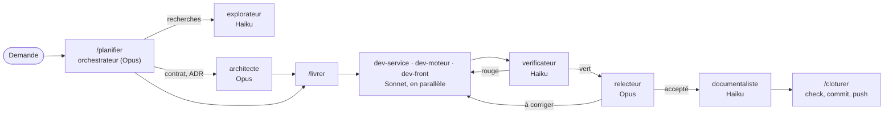

# Orchestration des agents

Le dépôt se développe en grande partie avec Claude Code. Pour tenir la qualité sans payer le prix fort à chaque
ligne, le travail est réparti entre trois modèles : **Opus décide et contrôle, Sonnet construit, Haiku exécute
et rapporte**. La décision est dans l'[ADR 0007](../adr/0007-orchestration-des-modeles.md) ; les règles que
Claude Code charge automatiquement sont dans `CLAUDE.md`.

## Les fichiers

| Fichier                       | Rôle                                                                                         |
| ----------------------------- | -------------------------------------------------------------------------------------------- |
| `AGENTS.md`                   | Règles de code communes à tous les outils et aux humains (inclus par `CLAUDE.md`)            |
| `CLAUDE.md`                   | Rôle de l'orchestrateur, répartition, escalade, parallélisme, fiche de tâche, compte rendu   |
| `.claude/agents/*.md`         | Les huit sous-agents : modèle, outils, périmètre, méthode, interdits                         |
| `.claude/skills/*/SKILL.md`   | Les trois étapes du cycle : `/planifier`, `/livrer`, `/cloturer`                             |
| `.claude/settings.json`       | Permissions partagées : commandes de vérification autorisées, fichiers protégés, push bornés |
| `.claude/settings.local.json` | Réglages personnels, ignorés par git                                                         |

## Répartition

| Agent            | Modèle | Rôle                                                                           | Écrit dans                              |
| ---------------- | ------ | ------------------------------------------------------------------------------ | --------------------------------------- |
| `architecte`     | Opus   | Découpe, conception, contrats, ADR, décisions transverses                      | `contracts/`, `docs/adr/`, plan         |
| `relecteur`      | Opus   | Revue finale d'un changement contre les directives                             | rien (rapport)                          |
| `dev-service`    | Sonnet | Une tâche dans un microservice                                                 | `services/<un seul>`                    |
| `dev-moteur`     | Sonnet | Une tâche dans un moteur de calcul                                             | `engines/<un seul>`                     |
| `dev-front`      | Sonnet | Modèles de vue, composants, écrans                                             | `packages/features`, `ui-web`, `apps/*` |
| `explorateur`    | Haiku  | Trouver où est quoi, résumer du code, lire des journaux                        | rien (rapport)                          |
| `verificateur`   | Haiku  | Lancer lint, types, tests, construction ; rapporter les échecs `fichier:ligne` | rien (rapport)                          |
| `documentaliste` | Haiku  | Changelog, tableau des travaux, pages `docs/`, `AGENTS.md` après un changement | `docs/`, `CHANGELOG.md`, `AGENTS.md`    |

Pourquoi ce partage : le coût d'une erreur de conception (un contrat mal découpé, une faille) dépasse de loin le
prix d'Opus, qui ne sert donc qu'à décider et relire. Le code de routine, bien borné par une fiche et vérifié par
les tests, est à la portée de Sonnet. Les tâches mécaniques et volumineuses (chercher, lancer des commandes,
mettre à jour la documentation) vont à Haiku, le moins cher et le plus rapide.

## Le cycle d'un lot de travail



1. **`/planifier`** : l'orchestrateur reformule la demande, fait explorer si besoin, confie la conception à
   `architecte` quand un contrat, plusieurs services, la sécurité ou une migration sont en jeu, puis découpe en
   tâches d'une demande de fusion chacune et les inscrit au [tableau des travaux](../suivi/travaux.md).
2. **`/livrer`** : le contrat d'abord, seul ; puis les tâches indépendantes partent en parallèle vers les agents
   Sonnet ; `verificateur` lance les vérifications ; `relecteur` relit le tout ; `documentaliste` met à jour le
   changelog, le tableau et les pages concernées.
3. **`/cloturer`** : `pnpm check` complet, commit au format Conventional Commits, push sur la branche de travail
   (le hook `pre-push` revérifie).

## Lancer une session

```text
/model opus                         # la session principale orchestre
/planifier ajouter la jupe trapèze au moteur de patronage et au studio
/livrer                             # exécute le plan validé
/cloturer                           # vérifie, commite, pousse
```

Une petite demande (une question, une correction d'une ligne) se traite directement, sans délégation. On peut
aussi appeler un agent précis : « demande à `explorateur` où est calculée l'aisance ».

## Fiche de tâche et compte rendu

Un sous-agent ne voit pas la conversation : tout ce qu'il doit savoir est dans sa fiche. Modèle (dans
`CLAUDE.md`) :

```markdown
Tâche : 1.xx (exemple) — Jupe trapèze dans le moteur de patronage
Objectif : POST /v1/patterns rend un patron de jupe trapèze pour le style « a-line ».
Périmètre : engines/patterning ; tout le reste en lecture seule.
Contexte : engines/patterning/AGENTS.md, docs/directives/moteurs.md, contrat garment-request (déjà à jour).
Critères d'acceptation : ourlet plus large que la hanche ; longueurs cohérentes aux coutures ; golden ajouté.
Hors périmètre : studio, contrats, autres moteurs.
Vérification : pnpm nx run patterning:test
Compte rendu attendu : format « Compte rendu ».
```

Chaque agent termine par un compte rendu court que l'orchestrateur contrôle avant d'enchaîner :

```markdown
## Compte rendu

- Fait : …
- Fichiers modifiés : …
- Tests ajoutés : …
- Vérification : commande lancée et résultat
- Points ouverts : … (ou « aucun »)
```

## Escalade

| Situation                                                                          | Qui reprend                         |
| ---------------------------------------------------------------------------------- | ----------------------------------- |
| Une tâche Haiku échoue deux fois, ou demande un jugement ou une correction de code | L'agent Sonnet du projet            |
| La tâche touche plus d'un service, ou un contrat change de façon incompatible      | `architecte` ou l'orchestrateur     |
| Sécurité, données sensibles, migration de base, référence golden                   | `architecte` ou l'orchestrateur     |
| `pnpm check` reste rouge après deux allers-retours                                 | L'orchestrateur                     |
| Un point ouvert que l'agent ne peut pas trancher                                   | L'orchestrateur, puis l'utilisateur |

Toujours vrai : un agent Haiku ne modifie pas de code, aucun agent ne sort de son périmètre, et seul
l'orchestrateur commite et pousse. `prototype/`, le code généré et les références golden sont protégés par
`.claude/settings.json` et ne se modifient que sur instruction explicite.

## Parallélisme

- Des tâches sur des projets différents, sans contrat commun modifié, partent en même temps.
- Pour des écritures simultanées dans le même dépôt, chaque agent travaille dans un arbre séparé (`worktree`).
- Vérification, relecture et documentation passent après l'intégration de toutes les tâches du lot.

## Coûts

- Lancer la session principale sur Opus seulement pour un lot de plusieurs tâches ; pour une petite correction,
  Sonnet suffit.
- Déléguer à Haiku tout ce qui ne demande pas de jugement : un aller-retour de recherche ou de vérification
  coûte peu et garde le contexte de l'orchestrateur léger.
- Une fiche complète évite les relances : c'est la première économie.
