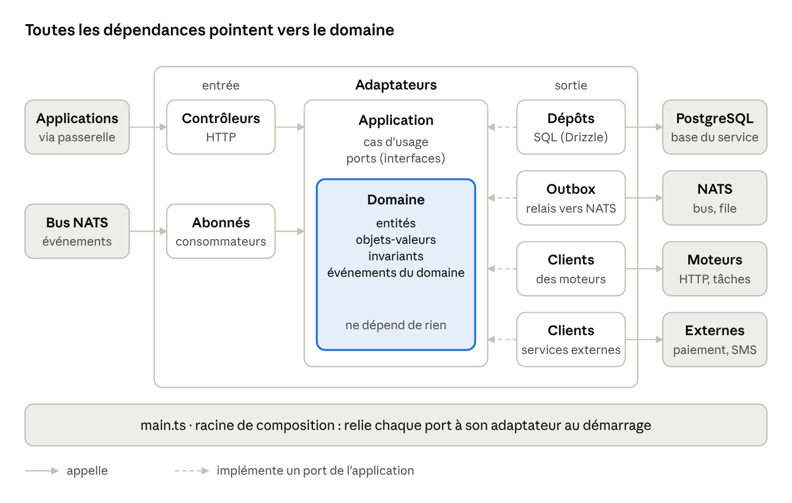

# 4. Anatomie d'un microservice

Tous les services ont la même forme, en quatre couches, et les dépendances pointent toujours vers le domaine.
Qui connaît un service connaît donc tous les autres, et un agent sait où poser chaque ligne sans deviner.
Le service de référence est `services/designs`.



Les adaptateurs d'entrée appellent les cas d'usage ; ceux de sortie implémentent les ports que l'application
déclare. Remplacer PostgreSQL, NATS ou un moteur ne touche donc qu'un adaptateur, jamais le domaine.

| Couche                      | Contient                                                                                   | A le droit de                                                        | N'a pas le droit de                                                         |
| --------------------------- | ------------------------------------------------------------------------------------------ | -------------------------------------------------------------------- | --------------------------------------------------------------------------- |
| `domain/`                   | Entités, objets-valeurs, invariants, événements du domaine                                 | Importer `@atelier/kernel` et des _types_ de `@atelier/contracts-ts` | Faire des entrées-sorties, importer un framework, lire l'heure ou le hasard |
| `application/`              | Cas d'usage (un fichier chacun), ports (interfaces vers l'extérieur)                       | Importer `domain`, déclarer des ports                                | Connaître HTTP, SQL, NATS ou NestJS                                         |
| `adapters/`                 | Entrée : contrôleurs HTTP, consommateurs. Sortie : dépôts SQL, outbox, clients des moteurs | Implémenter les ports, traduire les formats                          | Contenir une règle métier                                                   |
| `composition.ts`, `main.ts` | Configuration, câblage des ports aux adaptateurs, démarrage                                | Tout importer                                                        | Contenir de la logique                                                      |

Les deux premières lignes sont vérifiées par ESLint (`no-restricted-imports` par couche), avec un message qui dit
quoi faire.

```text
services/designs/
├─ AGENTS.md
├─ Dockerfile
├─ migrations/0001_init.sql       tables, sécurité par lignes, outbox (font foi)
├─ src/
│  ├─ domain/                     design.ts, design-version.ts, fingerprint.ts
│  ├─ application/
│  │  ├─ ports/                   design-repository.ts, patterning-engine.ts, hasher.ts
│  │  └─ use-cases/               create-design.ts, create-design-version.ts, get-design.ts
│  ├─ adapters/
│  │  ├─ http/                    contrôleur NestJS, validation par contrat, erreurs RFC 9457
│  │  ├─ persistence/             in-memory/ et postgres/ (Drizzle, migrate.ts)
│  │  ├─ engines/                 client HTTP du moteur de patronage
│  │  └─ platform/                empreinte SHA-256
│  ├─ composition.ts              configuration (zod) et câblage
│  └─ main.ts
└─ test/                          unit/, integration/ (PGlite), http/
```

Un cas d'usage est une fonction qui reçoit ses dépendances par paramètre et renvoie un résultat typé, sans
exception pour les erreurs prévues :

```ts
// services/designs/src/application/use-cases/create-design-version.ts (extrait)
export const createDesignVersion =
  (deps: CreateDesignVersionDeps) =>
  async (
    input: CreateDesignVersionInput,
  ): Promise<Result<DesignVersion, CreateDesignVersionError>> => {
    const design = await deps.designs.byId(input.organizationId, input.designId);
    if (!design) return err({ kind: 'design-not-found' });

    const spec = await deps.patterning.draft(input.measurements, input.garment);
    if (spec.isErr()) return spec;

    const fingerprint = deps.hasher.sha256(
      canonicalJson({
        measurements: input.measurements,
        garment: input.garment,
        engine: spec.value.engine,
      }),
    );
    const added = addVersion(design, {
      ...input,
      spec: spec.value,
      fingerprint,
      now: deps.clock.now(),
    });
    if (added.isErr()) return added;

    await deps.designs.saveNewVersion(added.value); // version, modèle et outbox : une transaction
    return ok(added.value.version);
  };
```

- Les entités sont immuables : une fonction du domaine renvoie le nouvel état et les événements produits,
  jamais un objet modifié en place (`addVersion`).
- Les contrôleurs sont minces : valider l'entrée avec le schéma du contrat, appeler un cas d'usage, traduire le
  résultat en réponse HTTP (erreurs `application/problem+json`).
- NestJS n'apparaît que dans `adapters/http/` et `main.ts`, et toutes les injections sont explicites (jetons) :
  le domaine et les cas d'usage se testent sans démarrer le framework.
- Les lectures simples (listes, tableaux de bord) peuvent passer par des requêtes SQL dédiées dans
  `adapters/persistence/`, sans passer par le domaine.
- Chaque client d'un moteur ou d'un service externe traduit son format vers celui du domaine (couche
  anticorruption) : un changement chez eux ne touche qu'un adaptateur.
