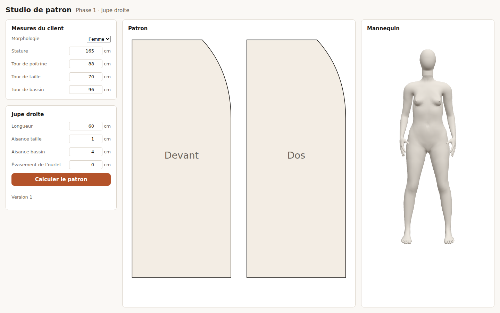

# Studio de patron

Le studio calcule le patron d'un vêtement à partir des mesures d'un client et montre, à côté, un mannequin 3D
ajusté aux mêmes mesures. C'est l'écran de la phase 1. Deux onglets : **Patron** (par défaut), et **Tissus**
pour valider et paramétrer les préréglages des tissus. Quatre types de vêtement sont proposés : jupe droite, jupe
cercle, pantalon et corsage (avec ou sans manches) ; les tracés de GarmentCode sont validés par référence.

## Utiliser le studio

1. Ouvrir le studio : http://localhost:8080 avec la pile Docker, ou http://localhost:5173 en développement
   (voir [Installation](../demarrer/installation.md)).
2. Choisir la morphologie et saisir les mesures du client, en centimètres.
3. Choisir un type de vêtement et ses paramètres : jupe droite, jupe cercle, pantalon ou corsage.
4. Cliquer sur **Calculer le patron**. Le patron s'affiche au centre avec les pièces de coupe, le mannequin
   ajusté à droite ; faire glisser le mannequin pour le tourner. Bascule 3D / silhouettes 2D en bas.
5. Télécharger les pièces de coupe au format SVG, PDF A4 tuilé ou DXF-AAMA via le bouton **Exporter**.
6. Chaque calcul crée une nouvelle version du modèle ; son numéro s'affiche sous le bouton.

## Mesures acceptées

Les bornes viennent du contrat (`contracts/schemas/measurement-set.schema.json`) ; un champ hors bornes est
signalé et le calcul ne part pas. Les mesures obligatoires par type de vêtement sont indiquées ci-dessous.

### Mesures générales

| Mesure           | Obligatoire | Bornes      |
| ---------------- | ----------- | ----------- |
| Stature          | oui         | 90 à 230 cm |
| Tour de poitrine | oui         | 50 à 180 cm |
| Tour de taille   | oui         | 40 à 180 cm |
| Tour de bassin   | oui         | 60 à 190 cm |

### Jupe droite

| Paramètre           | Obligatoire | Bornes      |
| ------------------- | ----------- | ----------- |
| Longueur de la jupe | oui         | 30 à 130 cm |
| Aisance taille      | non (1 cm)  | 0 à 8 cm    |
| Aisance bassin      | non (4 cm)  | 0 à 20 cm   |

### Jupe cercle

| Paramètre           | Obligatoire | Bornes      |
| ------------------- | ----------- | ----------- |
| Longueur de la jupe | oui         | 30 à 130 cm |
| Aisance taille      | non (1 cm)  | 0 à 8 cm    |
| Fraction de cercle  | non (1)     | 0,25 à 1    |
| Largeur de ceinture | non         | 0 à 10 cm   |

### Pantalon

| Paramètre            | Obligatoire | Bornes      |
| -------------------- | ----------- | ----------- |
| Hauteur d'entrejambe | **oui**     | 50 à 100 cm |
| Longueur du pantalon | oui         | 50 à 120 cm |
| Aisance taille       | non (1 cm)  | 0 à 8 cm    |
| Aisance bassin       | non (4 cm)  | 0 à 20 cm   |
| Tour de chevilles    | non         | 15 à 50 cm  |

### Corsage

| Paramètre                  | Obligatoire | Bornes      |
| -------------------------- | ----------- | ----------- |
| Tour de poitrine           | **oui**     | 50 à 180 cm |
| Longueur taille dos        | **oui**     | 20 à 60 cm  |
| Longueur corsage           | oui         | 10 à 50 cm  |
| Aisance poitrine           | non (2 cm)  | 0 à 10 cm   |
| Aisance taille             | non (1 cm)  | 0 à 8 cm    |
| Profondeur encolure devant | non         | 0 à 15 cm   |
| Profondeur encolure dos    | non         | 0 à 10 cm   |
| Manches                    | optionnel   | —           |

## Messages

| Message                                   | Cause                                                                | Que faire                                |
| ----------------------------------------- | -------------------------------------------------------------------- | ---------------------------------------- |
| « Mesure obligatoire manquante… »         | Mesure requise pour ce type (ex. hauteur d'entrejambe pour pantalon) | Saisir la mesure                         |
| « Patron impossible avec ces mesures. »   | Vêtement impossible (ex. jupe trop courte)                           | Ajuster les mesures ou les paramètres    |
| « Le moteur de patronage ne répond pas. » | Moteur arrêté ou trop lent                                           | Vérifier que le moteur tourne, réessayer |
| « Le service est injoignable. »           | Service `designs` arrêté                                             | Démarrer la pile (`pnpm stack:up`)       |

## Historique des versions

Chaque calcul d'un patron crée une nouvelle version du modèle, stockée au service. Dans l'onglet Patron, le
panneau « Historique » (repliable) affiche la liste des versions de la session, du plus récent au plus ancien.

**Reprendre une version** : cliquer sur « Reprendre la version _n_ » pour recharger ses mesures et ses
paramètres dans le formulaire ; le patron affiché est effacé jusqu'au prochain calcul. Si le formulaire contient
des modifications non calculées, une confirmation est demandée.

**Comparer deux versions** : Dans le panneau de comparaison (en bas du panneau Historique), choisir une version
de référence et une version comparée, puis cliquer sur « Comparer ». Les résultats affichent :

- les changements de paramètres (ex. « Longueur : 100 cm → 110 cm ») ;
- les changements de mesures du client (si elles ont été modifiées) ;
- pour chaque pièce, l'écart d'aire en cm² et l'écart de périmètre en cm ;
- les pièces ajoutées ou retirées entre les deux versions.

L'historique est limité au modèle de la session (ADR 0014) : les versions restent enregistrées par le service,
mais après un rechargement de la page le studio ne sait plus quel modèle afficher, faute de liste des modèles
d'une organisation. Rien n'est gardé dans le navigateur, car une version contient des mesures de client.

## Limites actuelles

- Pas encore : drapé 3D physique en tâche (travail 1.19, l'aperçu géométrique du vêtement porté est déjà là) ;
  tests de bout en bout (travail 1.24).
- Les références golden des tracés sont déclarées « candidates » : elles doivent être validées par un modéliste
  sur toile (porte de sortie 1.25).
