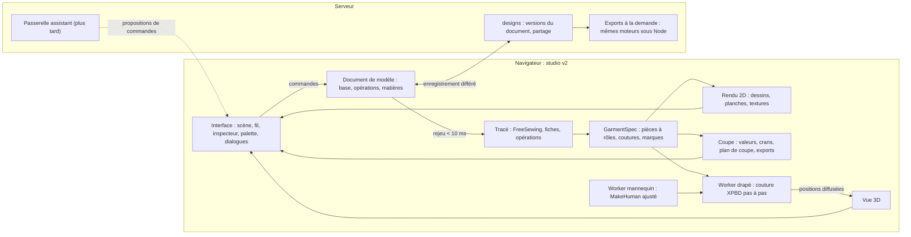
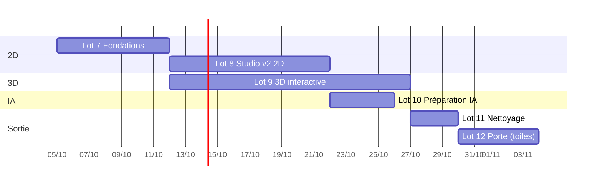

# Plan d'action : la plateforme autour du studio

**4 octobre 2026.** Ce plan remplace la [proposition du studio temps réel](proposition-temps-reel.md). Il repose sur
deux preuves mesurées, l'[essai de FreeSewing](essai-freesewing.md) et l'[essai des tuniques](essai-tuniques.md), et
sur cinq décisions : [0019](../adr/0019-trace-freesewing.md) (tracé),
[0020](../adr/0020-document-de-modele-et-operations.md) (document et opérations),
[0021](../adr/0021-studio-local-et-refonte-des-moteurs.md) (calcul local et moteurs),
[0022](../adr/0022-interface-du-studio-v2.md) (interface) et [0023](../adr/0023-preparation-ia.md) (IA).

## En bref

1. **Le studio calcule tout dans le navigateur** : tracé, opérations, dessin, patrons prêts à couper, exports, puis
   drapé 3D dans un Worker. Le serveur enregistre et partage. Résultat visé : le 2D répond en une image, hors ligne
   compris.
2. **Un modèle est un document** : une base FreeSewing tracée à la mesure, une liste d'opérations génériques
   (poche, bande, découpe, galon, broderie…), des matières par pièce. Aucun code par vêtement.
3. **Les moteurs sont refaits là où c'est utile** : patronage Python remplacé, fabrication portée en TypeScript,
   rendu 2D nouveau, cœur du drapé gardé et rendu interactif, mannequin gardé et étendu.
4. **Le studio v2 tient sur une scène** : le vêtement au centre, un fil de six étapes, on touche le vêtement pour
   le modifier, tout est commande, les dialogues ne servent que les tâches ciblées.
5. **L'IA viendra par les commandes** : elle proposera des lots de commandes, prévisualisés puis acceptés ; les
   emplacements d'interface sont préparés dès maintenant.
6. **Ordre : le 2D d'abord, puis la 3D**, la préparation de l'IA en parallèle. Environ cinq semaines jusqu'à la porte
   de sortie, toiles comprises.

## Pourquoi cette approche

| Option                                                 | Pour                                                     | Contre                                                                             | Verdict     |
| ------------------------------------------------------ | -------------------------------------------------------- | ---------------------------------------------------------------------------------- | ----------- |
| A. Garder les moteurs Python, accélérer l'API          | Rien à réécrire                                          | Aller-retour réseau à chaque geste, deux langages sur la boucle, pas de hors-ligne | Écartée     |
| **B. Studio local d'abord (TypeScript sur la boucle)** | Millisecondes, hors ligne, un langage, moins de serveurs | Poste client sollicité, dépendance à FreeSewing                                    | **Retenue** |
| C. Logiciel commercial (SDK CLO, Style3D, Browzwear)   | 3D aboutie                                               | Coût, code fermé, pas de patronage paramétrique ouvert ni de téléphone             | Écartée     |
| D. GarmentCode dans le navigateur (Pyodide)            | Reprend l'existant                                       | Environnement de plus de 30 Mo, lent à charger, quatre vêtements                   | Écartée     |
| E. Seamly2D ou Valentina                               | Patronage paramétrique mûr                               | Licence GPL, application de bureau                                                 | Écartée     |
| F. Tracés écrits par nous, sans bibliothèque           | Maîtrise totale                                          | Des semaines par vêtement                                                          | Écartée     |

Les chiffres qui décident (essais du 3 et du 4 octobre 2026) :

| Mesure                                  | Valeur                                                  |
| --------------------------------------- | ------------------------------------------------------- |
| Tracé FreeSewing à chaud                | 0,5 à 7 ms selon le modèle                              |
| Rejeu des opérations d'une tunique      | moins de 0,1 ms                                         |
| Dessin technique face ou dos            | 1 à 2 ms                                                |
| Planche de patrons prête à couper       | 1 à 2 ms                                                |
| Code propre à un vêtement               | 0 ligne pour cinq tuniques réelles                      |
| Drapé 3D du dépôt, tunique en brouillon | 8,7 s, coutures fermées à 0,1 mm, une manche à corriger |

## Architecture cible

| Élément                                         | Décision                                                                                     |
| ----------------------------------------------- | -------------------------------------------------------------------------------------------- |
| Monorepo, contrats d'abord, documentation, ADR  | Gardés                                                                                       |
| Service `designs`                               | Gardé : versions du document (JSONB), partage, exports à la demande                          |
| Mannequin `engines/mannequin`                   | Gardé, étendu : mesures FreeSewing, repères, parties du corps                                |
| Drapé `engines/drape`                           | Cœur XPBD gardé ; enveloppe refaite : pas à pas en Worker, grossier puis fin, départ à chaud |
| Patronage `engines/patterning` (Python)         | Remplacé par `engines/drafting` (FreeSewing, fiches, opérations), retiré à la parité         |
| Fabrication `engines/manufacturing` (Python)    | Portée dans `engines/cutting` (TypeScript), retirée à la parité des références golden        |
| Rendu 2D                                        | Nouveau : `engines/flats` (dessins face et dos, planches, textures de la 3D)                 |
| Studio `apps/studio`                            | Refait (v2) ; l'ancien reste derrière un drapeau jusqu'à la parité                           |
| Tâche NATS du drapé                             | Hors de la boucle du studio ; gardée pour les rendus haute qualité                           |
| Autres services, Kubernetes, application mobile | Reportés à la phase 2 (ADR 0001 inchangée pour la suite)                                     |

## Le studio v2 : simple, moderne, futuriste

Six principes (ADR 0022) :

1. **Une scène** : le vêtement reste au centre ; Dessin, Patron et 3D se remplacent sur place, ou se partagent
   l'écran.
2. **Un fil** : les six étapes se suivent sans jamais bloquer ; on revient à n'importe laquelle, la scène suit.
3. **On touche le vêtement** : une zone s'éclaire au survol ; un clic ouvre l'anneau des actions qui lui
   conviennent ; des poignées règlent longueurs et courbes, en direct.
4. **Tout est commande** : palette (⌘K ou « / »), raccourcis, historique, annuler et rétablir partout.
5. **Dialogues utiles seulement** : Mesures, Tissu, Export, Partage, Comparaison ; jamais de confirmation pour une
   action réversible, un bandeau « Annuler » suffit.
6. **Futuriste mais sobre** : thème sombre « atelier de nuit » et thème clair, un accent lumineux, le trait du dessin
   technique comme signature, mouvements courts, accessibilité WCAG 2.2 AA.

| Étape     | L'utilisateur                                             | La scène                                      | Dialogue                        |
| --------- | --------------------------------------------------------- | --------------------------------------------- | ------------------------------- |
| Modèle    | Choisit une base dans la galerie, une taille ou un client | Dessins vivants du catalogue                  | Mesures                         |
| Édition   | Touche une zone, choisit une action, règle par poignée    | Dessin face et dos, mis à jour à chaque geste | —                               |
| Matières  | Pose un tissu sur une zone, importe une photo de tissu    | Dessin en couleurs, motifs posés par pièce    | Tissu (échelle, sens, centrage) |
| Patrons   | Vérifie la planche, le plan de coupe et le métrage        | Planche prête à couper                        | Export (PDF, DXF, SVG)          |
| Habillage | Voit le vêtement porté de face et de dos                  | Dessin sur la silhouette du mannequin         | —                               |
| 3D        | Tourne autour, lit l'aisance et la tension                | Vêtement qui se coud puis tombe               | —                               |

**Maquette interactive** : le canevas « Studio Atelier v2 » (lien remis avec ce plan, privé jusqu'à son partage)
montre l'écran principal sur les cinq tuniques de l'essai (zones tirées de la géométrie, anneau d'actions par rôle,
palette de commandes filtrée, annuler et rétablir, dialogues Mesures, Tissu et Export, vue Dessin + 3D), la version
téléphone et la feuille des jetons et composants. Elle sert de référence aux tâches 1.62 à 1.69 ; les tests d'usage
décident des écarts.

## Prêt pour l'IA

- **Interface unique** : le catalogue des commandes, avec schémas et descriptions, exporté comme outils (ADR 0023).
- **Proposition, aperçu, accord** : l'IA propose un lot de commandes ; la scène montre la différence ; un clic
  l'applique en une étape annulable.
- **Emplacements dès la phase 1, derrière un drapeau** : palette en texte libre, panneau Assistant (suggestions
  déterministes), entrée « Partir d'une photo » à l'étape Modèle.
- **Plus tard** : passerelle `assistant` sur le serveur, indépendante du fournisseur ; premier jeu d'évaluation :
  les cinq tuniques de l'essai, de la photo au document.

## Feuille de route

Les numéros continuent le [tableau des travaux](travaux.md). Agents : architecte (Opus), dev-moteur, dev-front et
dev-service (Sonnet), vérificateur et documentaliste (Haiku), selon [l'orchestration](../demarrer/orchestration.md),
appliquée sans formalisme inutile.

### Lot 7 — Fondations 2D : contrats et moteurs (6 à 7 jours)

| #    | Travail                                                                                                              | Agent         | Dépend de  |
| ---- | -------------------------------------------------------------------------------------------------------------------- | ------------- | ---------- |
| 1.53 | ADR 0019 à 0023, plan d'action, essai des tuniques, documentation adaptée                                            | orchestrateur | —          |
| 1.54 | Contrats : `design-document`, `design-operation` (11 opérations), GarmentSpec 1.1, `MeasurementSet` (+9)             | architecte    | 1.53       |
| 1.55 | `engines/drafting` : adaptateur FreeSewing 4.10.2 épinglé, fiches de couture, contrôle de chaque tracé               | dev-moteur    | 1.54       |
| 1.56 | Catalogue 1 (Brian, Teagan, Titan, Sandy, Bella avec garde-fous, jupe droite) et banc de validation                  | dev-moteur    | 1.55       |
| 1.57 | Moteur d'opérations : registre, 11 opérations, régions, rejeu, règle « aucun nom de vêtement », preuve de généricité | dev-moteur    | 1.55       |
| 1.58 | `engines/cutting` : pièces de coupe, crans, plan de coupe et métrage, exports SVG, PDF A4, DXF ; parité golden       | dev-moteur    | 1.57       |
| 1.59 | `engines/flats` : dessins face et dos (trait, couleur), planches, textures par pièce                                 | dev-moteur    | 1.57       |
| 1.60 | `designs` : versions du document, validation par les moteurs sous Node, exports à la demande                         | dev-service   | 1.54, 1.58 |
| 1.61 | Mannequin : mesures FreeSewing, repères (encolure, acromion, aisselle, crête iliaque), parties du corps              | dev-moteur    | 1.54       |

Porte J1 : les cinq tuniques de l'essai rejouées dans les nouveaux moteurs, testées, en moins de 10 ms.

### Lot 8 — Studio v2, parcours 2D (8 à 10 jours)

| #    | Travail                                                                                                 | Agent         | Dépend de  |
| ---- | ------------------------------------------------------------------------------------------------------- | ------------- | ---------- |
| 1.62 | Jetons v2 (sombre, clair, accent, mouvement, élévation, focus) et composants de base                    | dev-front     | 1.53       |
| 1.63 | Magasin du document et bus de commandes : annuler, rétablir, historique, enregistrement différé, Worker | dev-front     | 1.57       |
| 1.64 | Coquille : scène unique, fil des six étapes, inspecteur, palette de commandes, raccourcis               | dev-front     | 1.62, 1.63 |
| 1.65 | Étape Modèle : galerie du catalogue, dialogue Mesures                                                   | dev-front     | 1.64, 1.56 |
| 1.66 | Étape Édition : zones cliquables, anneau d'actions, poignées, liste des opérations                      | dev-front     | 1.64, 1.59 |
| 1.67 | Étape Matières : bibliothèque, import de photo (échelle, sens, centrage), affectation par zone          | dev-front     | 1.66       |
| 1.68 | Étape Patrons : planche, plan de coupe et métrage, dialogue Export                                      | dev-front     | 1.58, 1.64 |
| 1.69 | Étape Habillage : dessin porté sur la silhouette face et dos, thèmes trait et couleur                   | dev-front     | 1.59, 1.61 |
| 1.70 | Tests d'usage (cinq tailleurs ou stylistes, tâche : refaire une tunique de l'essai), corrections        | orchestrateur | 1.65–1.69  |

Porte J2 : une tunique de l'essai refaite par un utilisateur sans aide, en moins de dix minutes, patrons exportés.

### Lot 9 — 3D interactive (8 à 10 jours)

| #    | Travail                                                                                                      | Agent      | Dépend de  |
| ---- | ------------------------------------------------------------------------------------------------------------ | ---------- | ---------- |
| 1.71 | Drapé : API pas à pas, entrée Worker, positions diffusées, maillage grossier puis fin, départ à chaud        | dev-moteur | 1.53       |
| 1.72 | Drapé : manche sous l'aisselle en pose en T (cas de l'essai), collisions par partie du corps ; remplace 1.46 | dev-moteur | 1.71, 1.61 |
| 1.73 | Document → GarmentSpec pour la 3D, matières → préréglages physiques                                          | dev-moteur | 1.57, 1.71 |
| 1.74 | Vue 3D : textures par coordonnées à plat, coutures, cartes d'aisance et de tension, qualité réglable         | dev-front  | 1.59, 1.71 |
| 1.75 | Budgets 3D mesurés ; palier WebGPU seulement si nécessaire (ADR)                                             | dev-moteur | 1.72–1.74  |

Porte J3 : les cinq tuniques cousues et drapées sans pénétration ni couture ouverte, première image en moins d'une
seconde, retouche visible en moins d'une seconde.

### Lot 10 — Préparation de l'IA (3 à 4 jours, en parallèle du lot 9)

| #    | Travail                                                                                          | Agent                  | Dépend de |
| ---- | ------------------------------------------------------------------------------------------------ | ---------------------- | --------- |
| 1.76 | Catalogue des commandes exporté en outils ; proposition = lot de commandes prévisualisé          | architecte → dev-front | 1.63      |
| 1.77 | Palette en texte libre, panneau Assistant (suggestions déterministes), entrée photo (désactivée) | dev-front              | 1.64      |
| 1.78 | Contrat de la passerelle `assistant`, jeu d'évaluation des cinq tuniques                         | architecte             | 1.76      |

### Lot 11 — Nettoyage et performances (3 jours)

| #    | Travail                                                                                  | Agent                   | Dépend de  |
| ---- | ---------------------------------------------------------------------------------------- | ----------------------- | ---------- |
| 1.79 | Retrait de `engines/patterning` et `engines/manufacturing`, pile Docker simplifiée       | dev-moteur, dev-service | 1.56, 1.58 |
| 1.80 | Ancien studio retiré, paquets mesurés, accessibilité vérifiée, budgets dans `pnpm check` | dev-front, vérificateur | 1.70, 1.75 |

### Lot 12 — Porte de sortie de la phase 1

| #    | Travail                                                                               | Agent         |
| ---- | ------------------------------------------------------------------------------------- | ------------- |
| 1.81 | Toiles des cinq tuniques et du catalogue 1 par un modéliste, références golden figées | humain        |
| 1.82 | Revue de la phase 1 et ouverture de la phase 2                                        | orchestrateur |

Le lot 9 commence pendant le lot 8 : son moteur ne dépend que des contrats et du drapé existant.

## Indicateurs de réussite

| Indicateur                        | Cible                                                                   |
| --------------------------------- | ----------------------------------------------------------------------- |
| Rejeu du document (tracé compris) | moins de 10 ms                                                          |
| Mise à jour 2D après un geste     | moins de 16 ms                                                          |
| Première image 3D, retouche 3D    | moins de 1 s ; drapé posé en moins de 5 s                               |
| Généricité                        | 0 nom de vêtement dans les moteurs ; compositions au hasard qui passent |
| Coutures et pénétration           | coutures fermées à 2 mm, pénétration sous 3 mm, catalogue × 5 tailles   |
| Facilité                          | une tunique refaite sans aide en moins de 10 minutes                    |
| Paquet d'entrée du studio         | moins de 350 ko compressés                                              |
| Patrons                           | toiles validées par un modéliste                                        |

## Risques et parades

| Risque                                   | Parade                                                                                   |
| ---------------------------------------- | ---------------------------------------------------------------------------------------- |
| FreeSewing change ou s'arrête            | Version épinglée, adaptateur unique, fiches testées ; reprise possible du code (MIT)     |
| Appareils modestes trop lents pour la 3D | Maillage grossier, niveaux de qualité, 2D toujours disponible, WebGPU en dernier recours |
| Manches et aisselles en 3D               | Cas de l'essai en premier test (1.72), collisions par partie du corps                    |
| Interface jugée complexe                 | Tests d'usage à chaque porte, dialogues limités, tout annulable                          |
| Retrait des moteurs Python trop tôt      | Parité golden exigée avant tout retrait                                                  |
| Périmètre qui gonfle                     | Ordre fixé : 2D, puis 3D, IA préparée seulement                                          |

## À confirmer

1. FreeSewing comme moteur de tracé (ADR 0019) et retrait des moteurs Python à la parité (ADR 0021).
2. L'identité visuelle du studio v2, sur la maquette.
3. Le panel de tests d'usage (cinq tailleurs ou stylistes) et la date des toiles avec un modéliste.
