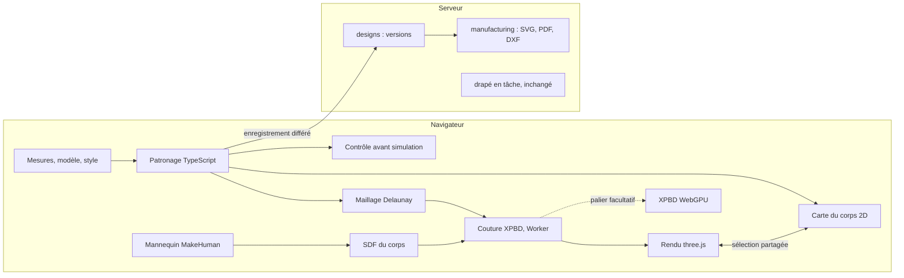

# Proposition : studio temps réel (phase 1, lots 7 à 12)

**Statut : proposition à valider (3 octobre 2026).** Rien n'est inscrit au [tableau des travaux](travaux.md) avant
la validation ; ensuite, `/planifier` inscrit les lots et `/livrer` lance le lot 7. La recherche qui fonde ce plan
est dans [Recherche : studio temps réel](recherche-temps-reel.md).

## En bref

- **Les moteurs actuels ne peuvent pas faire de temps réel, par construction.** Le patron se calcule sur le
  serveur et crée une version à chaque calcul. Le drapé est une tâche serveur sur CPU, rendue au bout de 3 à 55 s,
  que le studio interroge toutes les 2 s (ADR 0013).
- **Le vrai verrou est la mise en place des pièces, pas la vitesse du solveur.** Les réglages propres à chaque
  vêtement et l'échec du corsage à manches viennent de là. Les méthodes publiées (placement guidé par les coutures
  de Style3D, attaches de GarmentCodeData) le règlent, à condition que le patron dise le rôle de chaque bord.
- **Le temps réel est à portée avec le code actuel.** Le cœur du drapé tourne déjà dans un Worker du studio (essai
  de Cusick) et se situe à un facteur 1 à 3 du temps réel ; exécuté pas à pas, il montre le vêtement se coudre.
  WebGPU (82,9 % des sessions, 74 % sous Android) ne vient qu'en accélérateur, si les mesures l'exigent.
- **Aucun projet libre ne fournit ce moteur.** GarmentCode drape en 30 s sur RTX 3090 avec 72 % de succès, et son
  simulateur est sous licence non commerciale ; ContourCraft et Design2GarmentCode ne cousent pas de patrons 2D.
- **La vue « pièces autour de la silhouette, longueurs des bords, coutures colorées » n'existe nulle part telle
  quelle : on la construit en premier.** Elle aurait montré tout de suite la manche trop étroite.
- **Le patronage passe en TypeScript** (environ 1 900 lignes, parité contre les cinq références golden). **On gèle**
  ce qui ne sert pas à voir le vêtement sur le mannequin.

## Diagnostic

| Constat (3 octobre 2026) | Valeur                                                                         |
| ------------------------ | ------------------------------------------------------------------------------ |
| Commits                  | 134 en un peu plus de trois jours (68 `feat`, 20 `docs`, 17 `fix`)             |
| ADR                      | 18, 140 Ko ; l'ADR 0013 du drapé pèse 41 Ko avec huit amendements de réglage   |
| Drapé                    | 8 600 lignes de source et 5 700 de tests, premier poste du dépôt, version 0.12 |
| Temps d'un drapé         | brouillon : jupe droite 3 à 4 s, pantalon 18 s, jupe cercle environ 50 s       |
| Corsage à manches        | échec : manche de 18,8 cm de large pour un bras de 23,2 cm de tour (1.46)      |
| Qualité standard (1.47)  | 3 vêtements sur 5 en échec : jupe cercle, corsage, corsage à manches           |
| Patron 2D affiché        | pièces côte à côte, sans silhouette, sans longueurs de bords ni coutures       |

Causes :

1. **Architecture** : le drapé a été conçu comme un calcul en différé (studio → designs → outbox → NATS →
   travailleur → S3 → NATS → designs → interrogation) ; rien ne s'affiche avant la convergence.
2. **Méthode** : un réglage par vêtement (jupe cercle « en godets », pantalon « jambe par jambe », corsage « tenu
   aux épaules ») au lieu d'une mise en place générique ; le patron ne dit pas le rôle de ses bords. Le passage des
   bras de 9° à 30° puis 90° a coûté un lot de sept tâches.
3. **Retour visuel** : une erreur de patron n'apparaît qu'en « pénétration du corps » au bout d'un drapé ; le patron
   2D n'affiche ni longueurs ni coutures.
4. **Périmètre** : banc d'essai des tissus (11 lignes), historique des versions, bornes du contrat, sécurité RLS,
   taille des paquets ; Storybook, Playwright et Helm planifiés. Rien de cela ne rapproche de l'écran attendu.
5. **Coût fixe** : chaque fonctionnalité traverse quatre à six projets, plus ADR, changelog, tableau et relecture.
6. **Produit** : l'écran cible (patron 2D et vêtement 3D côte à côte, en direct) n'a jamais été décrit.

Ce qui se garde : le contrat GarmentSpec (placement et coutures compris), le patronage aux coutures égales à
0,5 mm, la fabrication (SVG, PDF, DXF-AAMA), le mannequin MakeHuman ajusté dans un Worker et mesuré par coupe
plane, le cœur XPBD et le maillage Delaunay, les critères de réussite du drapé, l'habillage géométrique, la
traduction ICU, les jetons et les tests.

## Architecture cible

Tout ce qui est interactif tourne dans le navigateur ; le serveur enregistre et exporte.

| Brique        | Choix                                                                                                                        |
| ------------- | ---------------------------------------------------------------------------------------------------------------------------- |
| Patronage     | Portage TypeScript du cœur Python, parité à 0,01 mm contre les cinq références golden                                        |
| Contrat       | GarmentSpec enrichi d'un champ facultatif : rôles de bord, sens endroit-envers des coutures, couche                          |
| Contrôle      | Table des coutures (appariée, aisée, suspecte), manche contre tour de bras, aisance par zone, avant toute simulation         |
| Solveur       | XPBD actuel (Float64, déterministe) dans un Worker, positions diffusées à chaque pas ; WASM SIMD puis WebGPU si besoin       |
| Collisions    | SDF du corps cuit après chaque ajustement (voxels de 5 à 8 mm), étiquettes de parties du corps, décalage de peau 3 mm        |
| Mise en place | Pièce-germe et alignement guidé par le graphe des coutures (Style3D 2024), attaches par rôle relâchées après N pas           |
| Retouche      | Départ à chaud par coordonnées 2D de pièce ; maillage grossier pendant le glissement, fin au repos (Sensitive Couture)       |
| Rendu         | WebGLRenderer conservé ; polylignes de couture et fils d'assemblage ; cartes d'aisance et de tension (`_EASE_MM`, `_STRAIN`) |

Le même code TypeScript tourne dans le Worker du studio et sur le serveur. Si WebGPU vient (lot 12), il sera un
aperçu comparé au CPU en millimètres : le WGSL n'a ni f64 ni atomiques flottants. La tâche de drapé NATS et S3
reste en place, hors du chemin critique.

Budgets et portes de sortie, mesurés sur de vrais appareils (les vitesses publiées viennent des auteurs et de
matériel de bureau ; aucune source ne mesure la couture sur GPU intégré ou sur téléphone) :

| Mesure                                    | Cible      | Condition                                                        |
| ----------------------------------------- | ---------- | ---------------------------------------------------------------- |
| Carte du corps au glissement d'un curseur | ≥ 30 img/s | Android d'entrée de gamme, cinq vêtements, trois niveaux de zoom |
| Recalcul du patron                        | < 5 ms     | bureau ; < 20 ms sur téléphone milieu de gamme                   |
| Première image du drapé                   | < 1 s      | après le choix du modèle, fils de couture visibles               |
| Drapé de brouillon posé                   | < 5 s      | portable de cinq ans, Worker                                     |
| Stable après une retouche                 | < 1 s      | départ à chaud                                                   |
| Écart entre Node et navigateurs           | < 0,1 mm   | même entrée, même code                                           |
| Qualité standard                          | 5 sur 5    | `test-standard` vert sans réglage par vêtement                   |
| JavaScript initial                        | < 350 Ko   | gzip ; three.js chargé à la demande                              |

## Studio

Un écran, deux vues synchronisées : **Carte du corps 2D** (pièces disposées à l'échelle autour de la silhouette
devant et dos, sur papier millimétré, sommets marqués, longueurs des bords en cm, crans, droit fil, coutures
colorées par paires avec une lettre) et **Vêtement 3D** (couture en direct, fils d'assemblage puis coutures,
cartes de tension de 100 à 120 % et d'aisance en mots). Pas de bouton « Calculer » : chaque curseur redessine le
patron et reprend la couture à chaud, la version s'enregistre en différé. On part d'un modèle (galerie, puis ruban
Vêtement, Mesures, Style ; l'avancé derrière « Plus »). Les alertes parlent atelier (« manche trop étroite de
4,4 cm au biceps », avec la correction en un clic). Style : graphite indigo, accent fil d'or, couleurs de fil pour
les coutures, thème clair, verre dépoli réservé aux barres flottantes et jamais derrière une cote. Clavier (⌘K),
tactile (cibles de 44 px) et téléphone (bascule Patron | Vêtement, inspecteur en feuille basse).

La « simulation 2D » couvre la carte du corps en direct, les vues techniques face et dos du vêtement drapé
projetées sur la silhouette, et plus tard la vue 2,5D prévue en phase 3 pour les téléphones modestes.

## Plan : voir d'abord, fiabiliser ensuite, accélérer en dernier

Durées au rythme actuel des agents, recalées après le lot 7.

### Lot 7 — Voir (3 jours, jalon J1)

Résultat visible : dans le studio actuel, la carte du corps avec nos patrons, les erreurs de couture signalées avant
toute simulation, et le vêtement qui se coud pas à pas. Relecture Opus (ADR, golden).

| N°    | Tâche                                                                                                                                                                           | Agent      | Dépend de  |
| ----- | ------------------------------------------------------------------------------------------------------------------------------------------------------------------------------- | ---------- | ---------- |
| 1.53  | ADR 0019 « Boucle interactive dans le navigateur » : Worker CPU en fondation, WebGPU en palier facultatif, tâche serveur hors du chemin critique, budgets, patronage TypeScript | architecte | validation |
| 1.54  | Carte du corps 2D : silhouettes devant et dos existantes, pièces selon `placement`, longueurs, sommets, crans, coutures lettrées, survol, zoom                                  | dev-front  | 1.53       |
| 1.55  | Contrôle avant simulation : table des coutures, manche contre tour de bras au même repère, aisance par zone                                                                     | dev-front  | 1.54       |
| 1.56a | Cœur du drapé : API pas à pas (`createSimulation`, `step`), résultats actuels inchangés                                                                                         | dev-moteur | 1.53       |
| 1.56b | Studio : drapé de brouillon dans un Worker, positions diffusées à chaque pas, fils de couture tant que la couture n'est pas fermée                                              | dev-front  | 1.56a      |
| 1.57  | Banc de débit (une journée) : pas par seconde à 25, 20 et 15 mm sur trois navigateurs, portable et Android ; identité Node et navigateurs ; coût d'un dispatch WebGPU           | dev-moteur | 1.56a      |
| 1.46  | Manche corrigée si 1.55 confirme la cause ; référence golden régénérée avec accord                                                                                              | dev-moteur | 1.55       |

### Lot 8 — Patron en direct (2 à 3 jours, jalon J2)

Résultat visible : les curseurs déforment le patron et la carte du corps en direct. Relecture Opus (golden).

| N°    | Tâche                                                                                  | Agent       | Dépend de    |
| ----- | -------------------------------------------------------------------------------------- | ----------- | ------------ |
| 1.58a | Paquet `@atelier/patterning` (TypeScript) : mesures, courbes, géométrie, contrôles     | dev-moteur  | 1.53         |
| 1.58b | Jupes droite et cercle, pinces, pièces communes                                        | dev-moteur  | 1.58a        |
| 1.58c | Pantalon, corsage, manche                                                              | dev-moteur  | 1.58a, 1.46  |
| 1.58d | Parité : cinq références golden à 0,01 mm, coutures égales à 0,5 mm                    | dev-moteur  | 1.58b, 1.58c |
| 1.58e | `designs` calcule avec le même paquet ; enregistrement d'une version calculée en local | dev-service | 1.58d        |
| 1.58f | Studio : calcul local à chaque curseur, version enregistrée en différé, sans bouton    | dev-front   | 1.58d        |

### Lot 9 — Couture robuste (4 à 5 jours, jalon J3)

Résultat visible : les cinq vêtements de référence se cousent en qualité standard sans réglage propre à un
vêtement ; `test-standard` est vert. Relecture Opus (contrat).

| N°    | Tâche                                                                                                                 | Agent                   | Dépend de    |
| ----- | --------------------------------------------------------------------------------------------------------------------- | ----------------------- | ------------ |
| 1.59a | Contrat : champ facultatif pour les rôles de bord, le sens endroit-envers des coutures et la couche ; ADR             | architecte              | 1.53         |
| 1.59b | Le patronage émet ces rôles (paquet TypeScript, et moteur Python tant qu'il sert)                                     | dev-moteur              | 1.59a, 1.58d |
| 1.59c | SDF du corps cuit après chaque ajustement, étiquettes de parties du corps, collisions contre le SDF                   | dev-moteur              | 1.53         |
| 1.59d | Mise en place guidée par le graphe des coutures et attaches par rôle, à la place des réglages par vêtement            | dev-moteur              | 1.59b, 1.59c |
| 1.59e | Critères étendus et grille de poses à 30, 45, 60 et 90° sur `test-standard` ; l'architecte tranche la pose de couture | dev-moteur → architecte | 1.59d        |
| 1.59f | Jupe cercle en standard : attaches à longue portée, multigrille si nécessaire                                         | dev-moteur              | 1.59d        |

### Lot 10 — Studio v2 (5 à 6 jours, en parallèle du lot 9, jalon J4)

Résultat visible : l'écran de la maquette, en vrai, sur bureau, tablette et téléphone. Relecture Sonnet.

| N°    | Tâche                                                                                                                             | Agent      | Dépend de    |
| ----- | --------------------------------------------------------------------------------------------------------------------------------- | ---------- | ------------ |
| 1.60a | Jetons v2 (sombre et clair, indigo, fil d'or, couleurs de fil) et composants (curseur, segmenté, inspecteur, palette ⌘K, feuille) | dev-front  | 1.53         |
| 1.60b | Coquille : barre du haut, rail, volets 2D et 3D, inspecteur, barre d'état, tablette et téléphone ; la carte du corps y entre      | dev-front  | 1.60a, 1.54  |
| 1.60c | Vue 3D v2 : tissu, polylignes de couture aux couleurs de la carte, cartes d'aisance et de tension, vues face, profil, dos         | dev-front  | 1.60b, 1.56b |
| 1.60d | Retouche à chaud par coordonnées 2D de pièce ; grossier pendant le glissement, fin au repos                                       | dev-moteur | 1.58f, 1.56b |
| 1.60e | Liaison 2D et 3D, historique nommé des réglages                                                                                   | dev-front  | 1.60c        |
| 1.60f | Vues techniques face et dos du vêtement drapé                                                                                     | dev-front  | 1.60c        |
| 1.60g | Accueil : galerie de modèles, mesures d'exemple, ruban Vêtement, Mesures, Style                                                   | dev-front  | 1.60b        |

### Lot 11 — Couverture et porte de sortie (3 à 5 jours plus les toiles, jalon J5)

Résultat visible : des toiles validées par un modéliste ; la phase 1 est close. Relecture Opus (golden figées).

| N°    | Tâche                                                                                                | Agent             | Dépend de    |
| ----- | ---------------------------------------------------------------------------------------------------- | ----------------- | ------------ |
| 1.61a | Robe (corsage et jupe), haut à manches avec col simple, sur le modèle de composition de GarmentCode  | dev-moteur        | 1.58d, 1.59b |
| 1.61b | Ceinture du pantalon et parementures ; auto-collision minimale si nécessaire                         | dev-moteur        | 1.59d        |
| 1.61c | Exports depuis le studio v2 et un parcours de bout en bout                                           | dev-front         | 1.60e        |
| 1.25  | Porte : toiles coupées depuis les exports, golden figées, écarts du mannequin relevés au mètre ruban | équipe, modéliste | 1.61c        |

### Lot 12 — Accélérer sur GPU (facultatif, environ une semaine)

Seulement si le banc 1.57 montre que le Worker, même avec WASM SIMD, reste loin des budgets : XPBD en WebGPU sous
contrat de tolérance (écart au CPU en mm), coloration des contraintes comme jspdown/cloth (MIT), budget de
dispatchs par image, limites de base vérifiées à la compilation, repli en cours de session.

## Mis de côté jusqu'à la porte

| Travail                                | Sort                                                                       |
| -------------------------------------- | -------------------------------------------------------------------------- |
| Storybook et captures (1.21a à d)      | Après la porte                                                             |
| Suites Playwright (1.24a à d)          | Un seul parcours de bout en bout (1.61c)                                   |
| Images CI, Helm, recette               | Phase 2                                                                    |
| Tâche de drapé NATS et S3              | Gardée telle quelle, sans évolution ; le studio n'en dépend plus           |
| Réglages par vêtement du drapé         | Plus d'investissement ; remplacés par la mise en place générique (lot 9)   |
| Banc d'essai des tissus                | Gardé en l'état                                                            |
| Historique et comparaison des versions | Gardés en l'état                                                           |
| Hors phase 1                           | Assistant IA, simulateurs neuronaux, VBD, AVBD, OGC, multicouche, pression |

Façon de travailler : un résultat visible et une courte démonstration filmée par lot ; essais techniques bornés à
une journée puis ADR d'une page ; réglages dans le journal du composant, pas en amendements d'ADR ; documentation
une fois par lot ; studio développé sans la pile Docker ; `pnpm check:affected` avant chaque push ; chaque
dépendance nouvelle (three-mesh-bvh par exemple) par une ADR.

## Décisions à prendre

1. Toute la boucle interactive dans le navigateur, sur le Worker CPU d'abord ; WebGPU seulement au lot 12, si le
   banc l'exige. Recommandé : oui.
2. Patronage porté en TypeScript (troisième exception à l'ADR 0003), Python gardé comme référence jusqu'à la
   parité puis retiré après la porte. Recommandé : oui. Alternative : garder Python avec un calcul d'aperçu sans
   version (environ 100 ms par appel, pas de glisser fluide, pas d'usage hors ligne).
3. Contrat enrichi (rôles de bord, sens des coutures, couche) en champ facultatif compatible. Recommandé : oui.
4. La liste de gel ci-dessus. Recommandé : oui.
5. Direction visuelle (graphite indigo et fil d'or, thème clair disponible), à valider sur la maquette.
6. Vêtements de la porte : les quatre actuels avec manches corrigées, plus robe et haut à manches ; un modèle
   prioritaire pour les clients (boubou, kaftan, chemise) peut remplacer l'un d'eux.
7. Validation sur toile : quel modéliste, et quand ; la même séance sert à calibrer le mannequin au mètre ruban.
8. Correction de la manche (1.46) : accord explicite pour régénérer la référence golden du corsage à manches.

## Risques

| Risque                                                 | Parade                                                                                      |
| ------------------------------------------------------ | ------------------------------------------------------------------------------------------- |
| Le Worker reste trop lent sur les appareils visés      | Maillage grossier pendant le glissement, WASM SIMD, puis lot 12 ; mesuré dès 1.57           |
| Mise en place générique incomplète (68 % chez Style3D) | Attaches par rôle, déplacement d'une pièce à la main, réglage par modèle en dernier recours |
| Identité Node et navigateurs non tenue                 | Tolérance de 0,1 mm vérifiée par 1.57 ; sinon le serveur recalcule la version enregistrée   |
| Tours du mannequin surestimés (2 à 3,5 cm)             | Calibration contre le mètre ruban à la porte                                                |
| Deux moteurs de patronage pendant le portage           | Parité contre les golden, retrait du Python après la porte                                  |
| SDF piégé dans un minimum local (aisselle, entrejambe) | Étiquettes de parties du corps, départ hors du corps, contrôle de pénétration existant      |
| Dérive du périmètre                                    | Liste de gel, démonstration par lot, tableau des travaux tenu à jour                        |
