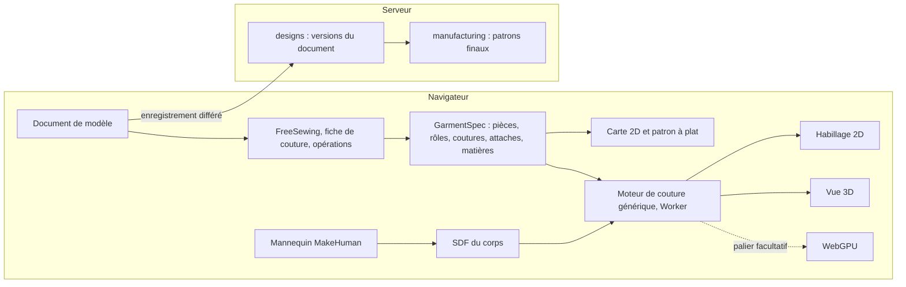

# Proposition : studio temps réel (phase 1, lots 7 à 11)

!!! warning "Remplacée"
Cette proposition est remplacée par le [plan d'action de la plateforme](plan-action-plateforme.md) du
4 octobre 2026 (ADR 0019 à 0023). Elle reste ici pour l'historique.

**Statut : proposition à valider, version 3 (3 octobre 2026).** Elle suit le flux demandé par l'utilisateur et
l'exigence d'un moteur générique et dynamique, sans aucun réglage par vêtement. Rien n'est inscrit au
[tableau des travaux](travaux.md) avant la validation ; ensuite, `/planifier` inscrit les lots et `/livrer` lance le
lot 7. La recherche qui fonde ce plan est dans [Recherche : studio temps réel](recherche-temps-reel.md).

## En bref

- **Aucun réglage par vêtement, nulle part.** Le moteur de couture ne connaît aucun vêtement : il lit le rôle de
  chaque bord et le graphe des coutures. Une règle de lint l'impose, et un test le prouve : des vêtements composés
  au hasard se cousent sans toucher au moteur.
- **Le flux devient l'ossature du studio** : Modèle, Édition, Matières, Patrons finaux, Habillage 2D, Vue 3D.
  Chaque étape se revisite et une modification se propage en direct aux suivantes.
- **FreeSewing devient notre moteur de tracé 2D** (MIT partout, publié sur npm, actif) : environ 70 modèles
  éprouvés, une bibliothèque de pièces, des options typées, le calcul en direct dans le navigateur. On y ajoute ce
  qui lui manque : une fiche de couture par modèle (rôles des bords, coutures, placement), des opérations génériques
  (poche, bande, garniture, fermeture), la matière de chaque pièce et le passage en 3D.
- **Les moteurs actuels ne font pas de temps réel, mais leur cœur se réutilise.** Le drapé est une tâche serveur en
  différé (3 à 55 s) ; son cœur tourne déjà dans un Worker du studio (essai de Cusick), à un facteur 1 à 3 du temps
  réel. WebGPU (82,9 % des sessions, 74 % sous Android) ne viendra qu'en accélérateur.
- **Le flux complet tient en environ quatre semaines**, en cinq lots qui suivent l'ordre des étapes.

## Le flux : six étapes, un seul document de modèle

Le studio enregistre un document : modèle choisi, mesures, options, liste des opérations, matière de chaque pièce.
Tout le reste s'en déduit, en direct.

| Étape            | Ce que fait l'utilisateur                                            | Ce que fait le moteur                                                                    | Où                     |
| ---------------- | -------------------------------------------------------------------- | ---------------------------------------------------------------------------------------- | ---------------------- |
| 1 · Modèle       | Choisit un modèle dans la galerie, saisit les mesures                | FreeSewing trace le modèle aux mesures ; la fiche de couture lui donne son sens          | Navigateur, < 10 ms    |
| 2 · Édition      | Ajoute poche, bande, accessoire, garniture ; règle les options       | Le moteur d'opérations rejoue la liste ; la carte 2D suit ; les coutures sont contrôlées | Navigateur, < 10 ms    |
| 3 · Matières     | Choisit tissu et imprimé de chaque pièce, importe un imprimé         | Chaque matière porte physique et apparence ; l'imprimé suit le droit fil                 | Navigateur             |
| 4 · Patrons      | Fixe valeurs de couture et tailles, exporte                          | Fabrication : valeurs de couture, crans, marques, gradation, plan de coupe, exports      | Serveur, moteur actuel |
| 5 · Habillage 2D | Voit le vêtement porté, de face et de dos, avec ses matières         | Assemblage grossier par le moteur de couture, rendu à plat sur la silhouette             | Navigateur, Worker     |
| 6 · Vue 3D       | Regarde le vêtement se coudre et tomber, lit les cartes d'ajustement | Même moteur en brouillon puis en HD, textures et coutures visibles                       | Navigateur, Worker     |

Retour libre : changer la taille d'une poche à l'étape 2 met à jour la carte 2D, les patrons finaux, l'habillage
2D et la 3D ; la couture repart de l'état précédent.

## Moteur générique et dynamique

1. **Le moteur de couture ne connaît aucun vêtement.** Il lit le rôle des bords (encolure, emmanchure, épaule, côté,
   taille, ourlet, entrejambe), le graphe des coutures, le placement et les attaches. Une règle de lint interdit tout
   nom de vêtement dans son code ; les réglages actuels (godets, jambe par jambe, tenues d'épaule) disparaissent.
2. **Un vêtement est une donnée.** Un modèle FreeSewing (pièces, mesures, options typées, extensions d'autres
   modèles) accompagné de sa fiche de couture, qui nomme le rôle de chaque bord, les coutures et le placement sur le
   corps. Les modèles qui manquent (boubou, kaftan) s'écrivent dans l'API de FreeSewing, puis reçoivent leur fiche.
3. **Une opération est générique.** « Poche plaquée » s'applique à n'importe quelle pièce ; « bande » et « volant
   froncé » à n'importe quel bord dont le rôle convient. Chaque opération produit ses pièces, coutures, attaches et
   marques, que la 2D, la fabrication et la 3D lisent sans code spécial.
4. **Tout est dynamique.** Le document se rejoue en moins de 10 ms à chaque geste ; la couture reprend à chaud,
   grossière pendant le glissement, fine au repos.

**Preuve de généricité.** Un générateur compose au hasard des vêtements du catalogue (blocs, options,
opérations), comme GarmentCodeData sur 115 000 vêtements. Chacun doit se coudre ou échouer avec un problème typé,
sans changer une ligne du moteur ; le taux de réussite est suivi à chaque lot, et une opération n'entre au
catalogue que si son test passe.

| Capacité                                                   | FreeSewing                      | Atelier                              |
| ---------------------------------------------------------- | ------------------------------- | ------------------------------------ |
| Modèle paramétrique : pièces, mesures, options typées      | Oui                             | Oui, même découpage                  |
| Un modèle en étend un autre (blocs)                        | Oui                             | Oui, plus des interfaces nommées     |
| Calcul en direct dans le navigateur, historique            | Oui                             | Oui                                  |
| Coutures appariées, rôle des bords, placement sur le corps | Non                             | Oui, dans le contrat                 |
| Poche, bande, garniture, fermeture                         | Options propres à chaque modèle | Opérations applicables à tout modèle |
| Matière par pièce, imprimés                                | Non                             | Oui, physique et apparence           |
| Patrons finaux                                             | Oui (SVG, PDF)                  | Oui, avec DXF-AAMA et gradation      |
| Habillage 2D, couture et drapé 3D                          | Non                             | Oui                                  |

Recommandation, révisée après lecture du code de FreeSewing 4.10.2 : l'utiliser directement comme moteur de tracé
2D. Le cœur, les modèles, les extensions et leurs dépendances (bezier-js, lodash, hooks) sont sous MIT ; les paquets
sont publiés sur npm ; le dernier commit date du 30 septembre 2026. Le cœur compte environ 7 300 lignes de
JavaScript sans types : un adaptateur typé le relie à notre contrat, dans le navigateur comme dans `designs`. On y
gagne environ 70 modèles cousus par une communauté, une bibliothèque de pièces (manche, manche en deux pièces,
capuche), des options riches, le plan de coupe, les crans et le droit fil. Il reste à écrire une fiche de couture
par modèle et la correspondance des mesures ; les mesures manquantes se prennent sur le mannequin ajusté. Nos quatre
vêtements Python, dont les références n'étaient que « candidates », sont remplacés par leurs équivalents FreeSewing
(Sandy, Titan, Bella) et retirés après la porte ; notre jupe droite est réécrite dans l'API de FreeSewing, Penelope
étant écartée. Le portage Python vers TypeScript n'a plus lieu.

L'essai du 3 octobre 2026 confirme ce choix, à conditions : tracé en 0,5 à 5 ms dans Chromium (Penelope exceptée),
fiches valables sur 5 tailles et 2 000 combinaisons d'options, contrôle de chaque tracé, embu déclaré, dépendances
épinglées. Détails dans [Essai de FreeSewing](essai-freesewing.md).

Premier catalogue d'opérations :

| Famille                   | Opérations                                                     | Ce qu'elles produisent                                               |
| ------------------------- | -------------------------------------------------------------- | -------------------------------------------------------------------- |
| Poches                    | Plaquée (forme réglable), passepoilée, dans la couture de côté | Pièces, marques de pose, attache de surface en 3D ou couture de côté |
| Bandes                    | Ceinture, poignet, bande d'encolure, biais, parementure        | Pièce dérivée de la longueur du bord, couture sur l'interface        |
| Garnitures                | Volant froncé, passepoil, galon, dentelle, frange              | Bande cousue avec un rapport de fronces, ou cousue en surface        |
| Fermetures et accessoires | Boutonnage, fermeture à glissière, passants, nœud              | Marques de boutons et de boutonnières, accessoires rigides en 3D     |
| Transformations           | Longueur, évasement, pinces changées en fronces, plis          | Modifient les blocs sans ajouter de pièce                            |

Matières : chaque matière porte sa physique (préréglages existants : popeline, wax, bazin, lin, denim, satin,
jersey) et son apparence (couleur, imprimé importé, échelle, sens par rapport au droit fil) ; une matière par pièce
et par couche (extérieur, doublure, entoilage). L'imprimé se pose avec les coordonnées à plat de la pièce, donc il
est juste sur la carte 2D, dans le plan de coupe et en 3D.

## Diagnostic

| Constat (3 octobre 2026) | Valeur                                                                         |
| ------------------------ | ------------------------------------------------------------------------------ |
| Commits                  | 134 en un peu plus de trois jours (68 `feat`, 20 `docs`, 17 `fix`)             |
| ADR                      | 18, 140 Ko ; l'ADR 0013 du drapé pèse 41 Ko avec huit amendements de réglage   |
| Drapé                    | 8 600 lignes de source et 5 700 de tests, premier poste du dépôt, version 0.12 |
| Temps d'un drapé         | brouillon : jupe droite 3 à 4 s, pantalon 18 s, jupe cercle environ 50 s       |
| Corsage à manches        | échec : manche de 18,8 cm de large pour un bras de 23,2 cm de tour (1.46)      |
| Qualité standard (1.47)  | 3 vêtements sur 5 en échec : jupe cercle, corsage, corsage à manches           |
| Patron 2D affiché        | pièces côte à côte, sans silhouette, sans longueurs de bords ni coutures       |

Causes : drapé conçu comme un calcul en différé ; réglage par vêtement au lieu d'un moteur générique (le patron ne
dit pas le rôle de ses bords) ; erreurs de patron visibles trop tard ; travail hors du chemin critique (banc
d'essai des tissus, historique, sécurité, Storybook, Playwright, Helm) ; coût fixe de quatre à six projets par
fonctionnalité ; flux jamais écrit. Ce qui se garde : contrat GarmentSpec, patronage aux coutures égalisées,
fabrication, mannequin MakeHuman, cœur XPBD et maillage, critères de réussite, préréglages de tissus, i18n, jetons,
tests.

## Architecture

| Brique             | Choix                                                                                                                          |
| ------------------ | ------------------------------------------------------------------------------------------------------------------------------ |
| Document de modèle | Modèle, mesures, options, opérations, matières : la version de `designs` ; la spécification s'en déduit par le même adaptateur |
| Tracé 2D           | FreeSewing 4.10.2 (MIT) derrière un adaptateur typé, navigateur et `designs` ; une fiche de couture par modèle                 |
| Contrat            | Champs facultatifs : rôle des bords, interfaces, coutures avec sens et fronces, attaches, marques, accessoires, matières       |
| Moteur de couture  | XPBD actuel en Worker, pas à pas ; mise en place par graphe de coutures et attaches par rôle ; aucun nom de vêtement           |
| Collisions         | SDF du corps cuit après chaque ajustement (voxels de 5 à 8 mm), étiquettes de parties du corps, décalage de peau de 3 mm       |
| Habillage 2D       | Assemblage grossier (30 à 40 mm) dans le Worker, rendu à plat de face et de dos, avec matières et coutures                     |
| Vue 3D             | three.js en WebGL, textures par coordonnées à plat, coutures visibles, cartes de tension et d'aisance ; WebGPU en option       |
| Patrons finaux     | Moteur de fabrication existant, étendu aux pièces et marques des opérations                                                    |

| Mesure                                    | Cible      | Condition                                               |
| ----------------------------------------- | ---------- | ------------------------------------------------------- |
| Rejouer le document (tracé et opérations) | < 10 ms    | bureau ; < 30 ms sur téléphone milieu de gamme          |
| Carte 2D au glissement d'un curseur       | ≥ 30 img/s | Android d'entrée de gamme                               |
| Habillage 2D                              | < 1,5 s    | assemblage grossier dans le Worker                      |
| Première image 3D                         | < 1 s      | pièces posées, fils de couture visibles                 |
| Drapé de brouillon posé                   | < 5 s      | portable de cinq ans                                    |
| Stable après une retouche                 | < 1 s      | départ à chaud                                          |
| Généricité                                | suivie     | compositions au hasard, à chaque lot, aucun faux succès |
| Qualité standard                          | 5 sur 5    | `test-standard` vert sans réglage par vêtement          |

## Plan : cinq lots qui suivent le flux (environ quatre semaines)

### Lot 7 — Socle générique et choix du modèle (4 jours, jalon J1 : étape 1)

| N°    | Tâche                                                                                                                                               | Agent      | Dépend de    |
| ----- | --------------------------------------------------------------------------------------------------------------------------------------------------- | ---------- | ------------ |
| 1.53  | ADR 0019 : boucle dans le navigateur, moteur sans aucun vêtement (lint), preuve de généricité, budgets                                              | architecte | validation   |
| 1.54  | ADR 0020 et contrats : GarmentSpec enrichi et document de modèle                                                                                    | architecte | 1.53         |
| 1.55a | Adaptateur FreeSewing vers GarmentSpec (prototype de l'essai) : version épinglée, `packageExtensions`, contrôle de chaque tracé, arrondi à 0,001 mm | dev-moteur | 1.54         |
| 1.55b | Mesures : `MeasurementSet` étendu de neuf mesures, repères ajoutés au mannequin, mesures manquantes prises sur le corps ajusté                      | dev-moteur | 1.54         |
| 1.55c | Fiches de couture et banc de validation : Teagan, Titan, Sandy, Tiberius, puis Bella avec garde-fous (épaule, manche, coupe)                        | dev-moteur | 1.55a        |
| 1.55f | Jupe droite écrite dans l'API de FreeSewing (Penelope écartée), coutures égalisées comme le moteur actuel                                           | dev-moteur | 1.55a        |
| 1.55d | Coquille du studio v2 : parcours en six étapes, jetons, composants, tablette et téléphone                                                           | dev-front  | 1.53         |
| 1.55e | Étape 1 : galerie de modèles, mesures, options du modèle, carte du corps 2D en direct, contrôle des coutures                                        | dev-front  | 1.55d, 1.55c |

### Lot 8 — Édition, matières, patrons finaux (5 jours, jalon J2 : étapes 2 à 4)

| N°    | Tâche                                                                                                  | Agent       | Dépend de    |
| ----- | ------------------------------------------------------------------------------------------------------ | ----------- | ------------ |
| 1.56a | Moteur d'opérations sur GarmentSpec, quel que soit le modèle : liste rejouée, annuler, contrôles       | dev-moteur  | 1.55a        |
| 1.56b | Poches et bandes                                                                                       | dev-moteur  | 1.56a        |
| 1.56c | Garnitures et fermetures                                                                               | dev-moteur  | 1.56a        |
| 1.56d | Étape 2 : options du modèle FreeSewing, palette d'opérations, pose par glisser, inspecteur, historique | dev-front   | 1.55e, 1.56a |
| 1.56e | Étape 3 : bibliothèque de matières, affectation par pièce et par couche, import d'imprimé, textures 2D | dev-front   | 1.55e        |
| 1.56f | Fabrication : pièces et marques des opérations, valeurs de couture par rôle de bord                    | dev-moteur  | 1.54         |
| 1.56g | Étape 4 : patron à plat, valeurs de couture, gradation, plan de coupe, exports                         | dev-front   | 1.56f        |
| 1.56h | `designs` : le document de modèle devient la version, enregistrée en différé                           | dev-service | 1.54, 1.55a  |

### Lot 9 — Moteur de couture générique (6 à 7 jours, commencé pendant le lot 8, jalon J3)

| N°    | Tâche                                                                                                         | Agent                    | Dépend de    |
| ----- | ------------------------------------------------------------------------------------------------------------- | ------------------------ | ------------ |
| 1.57a | Cœur : API pas à pas, Worker qui diffuse les positions, matière par pièce                                     | dev-moteur               | 1.53         |
| 1.57b | SDF du corps, étiquettes de parties du corps, collisions contre le SDF                                        | dev-moteur               | 1.53         |
| 1.57c | Mise en place par graphe de coutures et attaches par rôle ; retrait des réglages par vêtement ; règle de lint | architecte → dev-moteur  | 1.54, 1.57b  |
| 1.57d | Opérations en 3D : fronces, poches attachées, bandes, accessoires rigides                                     | dev-moteur               | 1.57c, 1.56c |
| 1.57e | Preuve de généricité (compositions au hasard, taux suivi) et `test-standard` sur cinq vêtements               | dev-moteur, verificateur | 1.57d        |
| 1.57f | Banc de débit sur trois appareils réels, identité Node et navigateurs ; décide WASM SIMD et WebGPU            | dev-moteur               | 1.57a        |

### Lot 10 — Habillage 2D et passage 3D (4 à 5 jours, jalon J4 : étapes 5 et 6)

| N°    | Tâche                                                                                           | Agent                 | Dépend de    |
| ----- | ----------------------------------------------------------------------------------------------- | --------------------- | ------------ |
| 1.58a | Étape 5 : assemblage grossier, vues de face et de dos du vêtement habillé, matières et coutures | dev-front             | 1.57d        |
| 1.58b | Étape 6 : vue 3D texturée, fils puis lignes de couture, cartes de tension et d'aisance          | dev-front             | 1.57d        |
| 1.58c | Dynamique : une modification aux étapes 2 et 3 met à jour 4, 5 et 6 (départ à chaud)            | dev-moteur, dev-front | 1.58a, 1.58b |
| 1.58d | Liaison 2D et 3D, finitions tablette et téléphone                                               | dev-front             | 1.58b        |

### Lot 11 — Porte de sortie (3 à 5 jours plus les toiles, jalon J5)

| N°    | Tâche                                                                                               | Agent             | Dépend de |
| ----- | --------------------------------------------------------------------------------------------------- | ----------------- | --------- |
| 1.59a | Un parcours de bout en bout, de la galerie à l'export et à la 3D                                    | dev-front         | 1.58c     |
| 1.25  | Toiles coupées depuis les exports, écarts corrigés, golden figées, mannequin calibré au mètre ruban | équipe, modéliste | 1.59a     |

Lots facultatifs : **12, WebGPU**, seulement si le banc 1.57f l'exige ; **13, catalogue**, fiches de couture
d'autres modèles FreeSewing (Simon, Huey, Charlie…) et modèles locaux (boubou, kaftan) écrits dans l'API de
FreeSewing, sans toucher au moteur.

## Mis de côté jusqu'à la porte

| Travail                           | Sort                                                                     |
| --------------------------------- | ------------------------------------------------------------------------ |
| Storybook et captures (1.21a à d) | Après la porte                                                           |
| Suites Playwright (1.24a à d)     | Un seul parcours de bout en bout (1.59a)                                 |
| Images CI, Helm, recette          | Phase 2                                                                  |
| Tâche de drapé NATS et S3         | Gardée telle quelle, sans évolution ; le studio n'en dépend plus         |
| Réglages par vêtement du drapé    | Retirés au lot 9, remplacés par la mise en place générique               |
| Banc d'essai des tissus           | Gardé en l'état ; ses préréglages alimentent la bibliothèque de matières |
| Hors phase 1                      | Assistant IA, simulateurs neuronaux, multicouche complexe, pression      |

## Décisions à prendre

1. Moteur générique : aucun vêtement dans le moteur de couture, preuve par compositions au hasard. Recommandé : oui.
2. Moteur de tracé : FreeSewing utilisé directement, dépendance MIT aux versions figées (recommandé, révisé après
   lecture de son code), ou notre propre noyau sur son modèle en portant nos quatre vêtements Python ; et les
   modèles FreeSewing à mettre au premier catalogue.
3. Premier catalogue d'opérations à valider ou compléter (col, capuche, fente, smocks, broderie…).
4. Imprimés importés par l'utilisateur (photo d'un wax) dès la phase 1. Proposé : oui, avec échelle et sens.
5. Boucle dans le navigateur, Worker d'abord, WebGPU en option, liste de gel. Recommandé : oui.
6. Délai : flux complet en environ quatre semaines ; environ trois si garnitures et fermetures passent après la
   porte.
7. Validation sur toile (quel modéliste, quand) et accord pour régénérer la référence golden du corsage à manches.

## Risques

| Risque                                                 | Parade                                                                                       |
| ------------------------------------------------------ | -------------------------------------------------------------------------------------------- |
| Mise en place générique incomplète (68 % chez Style3D) | Attaches par rôle, déplacement d'une pièce à la main ; taux mesuré à chaque lot              |
| Une opération crée un cas 3D nouveau                   | Une opération n'entre au catalogue que si son test de couture passe                          |
| Le Worker reste trop lent sur les appareils visés      | Maillage grossier pendant le glissement, WASM SIMD, puis lot 12                              |
| Dépendance externe (FreeSewing)                        | Versions figées, adaptateur testé contre des références ; MIT, donc reprise possible du code |
| Fiche de couture erronée                               | Contrôle automatique des longueurs de couture et test de couture pour chaque modèle          |
| Tours du mannequin surestimés (2 à 3,5 cm)             | Calibration contre le mètre ruban à la porte                                                 |
| Périmètre plus large que la phase 1 initiale           | Chaque lot livre une étape utilisable ; garnitures et fermetures peuvent glisser             |
