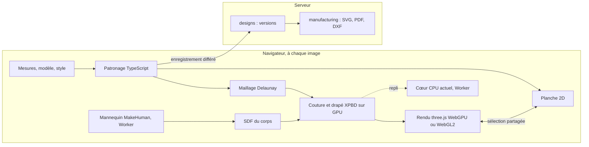

# Proposition : studio temps réel (phase 1, lots 7 à 11)

**Statut : proposition à valider (3 octobre 2026).** Rien n'est inscrit au [tableau des travaux](travaux.md) avant
la validation ; ensuite, `/planifier` inscrit les lots et `/livrer` lance le lot 7. Le rapport de recherche qui
fonde ce plan sera ajouté à côté de cette page.

## En bref

- **Les moteurs actuels ne peuvent pas faire de temps réel, par construction.** Le patron se calcule sur le
  serveur et crée une version à chaque calcul. Le drapé est une tâche serveur sur CPU, un seul fil, rendue au bout
  de 3 à 55 s, que le studio interroge toutes les 2 s (ADR 0013).
- **Le temps réel est à portée avec ce qui existe.** Le cœur du drapé tourne déjà dans un Worker du studio (essai de
  Cusick), le maillage est compatible navigateur, le mannequin s'ajuste dans un Web Worker. Il faut coudre sur la
  carte graphique (WebGPU, repli WebGL2 ou CPU) et afficher la simulation à chaque image.
- **Aucun projet libre ne fournit ce moteur.** GarmentCode drape en 30 s sur RTX 3090 avec 72 % de succès, et son
  simulateur est sous licence non commerciale ; ContourCraft et Design2GarmentCode ne cousent pas de patrons 2D.
- **Le patronage passe en TypeScript dans le navigateur** (environ 1 900 lignes, parité contre les cinq références
  golden) : chaque curseur redessine le patron en quelques millisecondes.
- **La vue « pièces autour de la silhouette, longueurs des bords, coutures colorées » n'existe nulle part telle
  quelle** : on la construit à partir de nos patrons.
- **On gèle ce qui ne sert pas à voir le vêtement sur le mannequin** jusqu'à la porte de sortie.

## Diagnostic

| Constat (3 octobre 2026) | Valeur                                                                         |
| ------------------------ | ------------------------------------------------------------------------------ |
| Commits                  | 134 en un peu plus de trois jours (68 `feat`, 20 `docs`, 17 `fix`)             |
| ADR                      | 18, 140 Ko ; l'ADR 0013 du drapé pèse 41 Ko avec huit amendements de réglage   |
| Drapé                    | 8 600 lignes de source et 5 700 de tests, premier poste du dépôt, version 0.12 |
| Temps d'un drapé         | brouillon : jupe droite 3 à 4 s, pantalon 18 s, jupe cercle environ 50 s       |
| Corsage à manches        | échec : manche de 18,8 cm de large pour un bras de 23,2 cm de tour (1.46)      |
| Qualité standard (1.47)  | 3 vêtements sur 5 en échec : jupe cercle, corsage, corsage à manches           |
| Patron 2D affiché        | pièces côte à côte, sans silhouette, sans longueurs de bords ni coutures       |

Causes :

1. **Architecture** : le drapé a été conçu comme un calcul en différé (studio → designs → outbox → NATS →
   travailleur → S3 → NATS → designs → interrogation). CPU, un seul fil, Float64, déterminisme au bit près : ce
   choix sert les références golden et exclut le temps réel.
2. **Méthode** : un réglage par vêtement (jupe cercle « en godets », pantalon « jambe par jambe », corsage « tenu
   aux épaules ») au lieu d'un placement générique. Chaque changement d'avatar relance tout : le passage des bras de
   9° à 30° puis 90° a coûté un lot de sept tâches.
3. **Retour visuel** : une erreur de patron n'apparaît qu'en « pénétration du corps » au bout d'un drapé ; le patron
   2D n'affiche ni longueurs ni coutures.
4. **Périmètre** : banc d'essai des tissus (11 lignes), historique des versions, bornes du contrat, sécurité RLS,
   taille des paquets ; Storybook, Playwright et Helm planifiés. Rien de cela ne rapproche de l'écran attendu.
5. **Coût fixe** : chaque fonctionnalité traverse quatre à six projets, plus ADR, changelog, tableau et relecture.
6. **Produit** : l'écran cible (patron 2D et vêtement 3D côte à côte, en direct) n'a jamais été décrit.

Ce qui se garde : le contrat GarmentSpec (placement et coutures compris), le patronage aux coutures égales à
0,5 mm, la fabrication (SVG, PDF, DXF-AAMA), le mannequin MakeHuman ajusté dans un Worker, le cœur XPBD et le
maillage Delaunay, l'habillage géométrique, la traduction ICU, les jetons et les tests.

## Architecture cible

Tout ce qui est interactif tourne dans le navigateur ; le serveur enregistre et exporte.

| Brique      | Choix                                                                                                            |
| ----------- | ---------------------------------------------------------------------------------------------------------------- |
| Patronage   | Portage TypeScript du cœur Python, parité à 0,01 mm contre les cinq références golden                            |
| Maillage    | Delaunay contraint existant ; 20 mm en brouillon, 10 mm en HD                                                    |
| Solveur     | XPBD à petits pas ; GPU : Jacobi par sommet (peu de dispatchs) ; CPU : Gauss-Seidel actuel dans un Worker        |
| Contraintes | Étirement chaîne et trame, flexion, coutures à raideur progressive, attaches taille et col relâchées             |
| Collisions  | SDF du corps (8 mm, environ 7 Mo), décalage de peau 3 mm, frottement ; auto-collision après la porte             |
| Placement   | Volumes autour des membres tirés de `Panel.placement`, alignement guidé par les coutures (Style3D, TOG 2024)     |
| Étapes      | Assemblage sans gravité, drapé, stabilité ; affichés en direct, liens de couture visibles qui se resserrent      |
| Retouche    | Départ à chaud : forme 3D précédente reportée sur le nouveau maillage par les coordonnées 2D des pièces          |
| Rendu       | three.js r186 WebGPURenderer (repli WebGL2), matériau tissu TSL, lignes de couture, cartes de tension et aisance |

Le GPU montre, le CPU fait foi : la simulation GPU n'est pas déterministe au bit près (WGSL sans f64 ni atomiques
flottants) ; le cœur CPU actuel reste la référence des tests, et les deux se comparent en millimètres. La tâche de
drapé NATS et S3 est gelée, gardée pour les rendus haute définition et les traitements par lots.

Budgets de vitesse, mesurés dès le lot 7 (les cibles mobiles sont des hypothèses : aucune source ne publie de
mesure de couture sur GPU intégré ou sur téléphone) :

| Mesure                       | Cible      | Condition                                                  |
| ---------------------------- | ---------- | ---------------------------------------------------------- |
| Recalcul du patron           | < 5 ms     | bureau ; < 20 ms sur téléphone milieu de gamme             |
| Mise à jour de la planche 2D | < 16 ms    | une image à 60 img/s                                       |
| Simulation GPU en brouillon  | ≥ 30 img/s | 2 000 à 6 000 sommets, GPU intégré ; 60 img/s carte dédiée |
| Repli CPU                    | ≥ 20 img/s | jusqu'à 2 000 sommets, maillage de 25 à 30 mm              |
| Vêtement visible             | < 1 s      | après le choix du modèle                                   |
| Coutures fermées             | < 3 s      | cinq vêtements de référence                                |
| Stable après une retouche    | < 1 s      | départ à chaud                                             |
| JavaScript initial           | < 350 Ko   | gzip ; three.js chargé à la demande                        |

## Studio

Un écran, deux vues synchronisées : **Patron 2D** (pièces disposées autour de la silhouette devant et dos, sur
papier millimétré, sommets marqués, longueurs des bords en cm, crans, droit fil, coutures colorées par paires avec
une lettre) et **Vêtement 3D** (couture en direct, coutures visibles, cartes de tension de 100 à 120 % et
d'aisance). Pas de bouton « Calculer » : chaque curseur redessine le patron et reprend la couture à chaud, la version
s'enregistre en différé. On part d'un modèle (galerie, mesures d'exemple, réglages avancés cachés). Les alertes
parlent atelier (« manche trop étroite de 4,4 cm au biceps », avec la correction en un clic). Style : graphite
indigo, accent fil d'or, couleurs de fil pour les coutures, thème clair disponible, verre dépoli réservé aux barres
flottantes. Clavier (⌘K), tactile (cibles de 44 px) et téléphone (bascule Patron | Vêtement, réglages en feuille).

La « simulation 2D » couvre la planche 2D en direct, les vues techniques face et dos du vêtement drapé projetées
sur la silhouette, et plus tard la vue 2,5D prévue en phase 3 pour les téléphones modestes.

## Plan

Durées au rythme actuel des agents, recalées après le lot 7. Relecture Opus pour les lots qui touchent une ADR ou
une référence golden (7, 8, 11), Sonnet sinon.

### Lot 7 — Cadrage et premières preuves (2 à 3 jours, jalon J1 : drapé en direct)

| N°    | Tâche                                                                                                                              | Agent      | Dépend de  |
| ----- | ---------------------------------------------------------------------------------------------------------------------------------- | ---------- | ---------- |
| 1.53  | ADR 0019 « Boucle interactive dans le navigateur » (GPU aperçu, CPU référence, tâche serveur gelée, budgets, patronage TypeScript) | architecte | validation |
| 1.54a | Cœur du drapé : API pas à pas (`createSimulation`, `step`), résultats actuels inchangés                                            | dev-moteur | 1.53       |
| 1.54b | Studio : Worker de drapé et affichage progressif du vêtement ; corps repris du mannequin ajusté                                    | dev-front  | 1.54a      |
| 1.55  | Banc d'essai GPU (une journée) : XPBD par sommet et SDF sur jupe droite et pantalon, img/s sur trois machines, TSL contre WGSL     | dev-moteur | 1.53       |
| 1.46  | Manche : largeur au biceps depuis le tour de bras et l'aisance, contrôle « manche ≥ bras », golden régénérée avec accord           | dev-moteur | —          |

### Lot 8 — Patronage dans le navigateur (2 à 3 jours, jalon J2 : patron en direct)

| N°    | Tâche                                                                                  | Agent       | Dépend de    |
| ----- | -------------------------------------------------------------------------------------- | ----------- | ------------ |
| 1.56a | Paquet `@atelier/patterning` (TypeScript) : mesures, courbes, géométrie, contrôles     | dev-moteur  | 1.53         |
| 1.56b | Jupes droite et cercle, pinces, pièces communes                                        | dev-moteur  | 1.56a        |
| 1.56c | Pantalon, corsage, manche                                                              | dev-moteur  | 1.56a, 1.46  |
| 1.56d | Parité : cinq références golden à 0,01 mm, coutures égales à 0,5 mm                    | dev-moteur  | 1.56b, 1.56c |
| 1.56e | `designs` calcule avec le même paquet ; enregistrement d'une version calculée en local | dev-service | 1.56d        |
| 1.56f | Studio : calcul local à chaque curseur, version enregistrée en différé, sans bouton    | dev-front   | 1.56d        |

### Lot 9 — Moteur de couture temps réel (5 à 6 jours, jalon J3 : cinq vêtements cousus en direct)

| N°    | Tâche                                                                                                  | Agent                    | Dépend de    |
| ----- | ------------------------------------------------------------------------------------------------------ | ------------------------ | ------------ |
| 1.57a | SDF du corps depuis le mannequin affiché, décalage de peau, tests de distance                          | dev-moteur               | 1.55         |
| 1.57b | Solveur GPU : étirement, flexion, coutures, collision SDF, frottement, amortissement, vitesse maximale | dev-moteur               | 1.55, 1.57a  |
| 1.57c | Placement générique guidé par les coutures ; pose de couture (T 90° ou A 45–50°) mesurée               | architecte → dev-moteur  | 1.53         |
| 1.57d | Étapes assemblage, drapé, stabilité ; attaches relâchées ; qualités brouillon et HD                    | dev-moteur               | 1.57b, 1.57c |
| 1.57e | Retouche à chaud par coordonnées 2D de pièce                                                           | dev-moteur               | 1.57d        |
| 1.57f | Parité GPU et CPU en mm, banc de vitesse automatique sur les cinq vêtements                            | dev-moteur, verificateur | 1.57d        |

### Lot 10 — Studio v2 (5 à 6 jours, en parallèle du lot 9, jalon J4 : l'écran de la maquette)

| N°    | Tâche                                                                                                                             | Agent     | Dépend de    |
| ----- | --------------------------------------------------------------------------------------------------------------------------------- | --------- | ------------ |
| 1.58a | Jetons v2 (sombre et clair, indigo, fil d'or, couleurs de fil) et composants (curseur, segmenté, inspecteur, palette ⌘K, feuille) | dev-front | 1.53         |
| 1.58b | Coquille : barre du haut, rail, volets 2D et 3D redimensionnables, inspecteur, barre d'état, tablette et téléphone                | dev-front | 1.58a        |
| 1.58c | Planche 2D : silhouettes devant et dos, pièces selon `placement`, longueurs, sommets, crans, coutures lettrées, zoom              | dev-front | 1.58b, 1.56f |
| 1.58d | Vue 3D v2 : WebGPURenderer, matériau tissu TSL, lignes de couture, cartes de tension et d'aisance                                 | dev-front | 1.58b, 1.57b |
| 1.58e | Liaison 2D et 3D : survol et sélection partagés                                                                                   | dev-front | 1.58c, 1.58d |
| 1.58f | Vues techniques 2D face et dos du vêtement drapé                                                                                  | dev-front | 1.58d        |
| 1.58g | Accueil : galerie de modèles, mesures d'exemple, guide en trois étapes                                                            | dev-front | 1.58b        |

### Lot 11 — Couverture et porte de sortie (3 à 5 jours plus les toiles, jalon J5 : toiles validées)

| N°    | Tâche                                                                                      | Agent             | Dépend de |
| ----- | ------------------------------------------------------------------------------------------ | ----------------- | --------- |
| 1.59a | Robe (corsage et jupe), haut à manches avec col simple, d'après les composants GarmentCode | dev-moteur        | 1.56d     |
| 1.59b | Ceinture du pantalon et parementures ; auto-collision minimale si nécessaire               | dev-moteur        | 1.57d     |
| 1.59c | Exports depuis le studio v2 et un parcours de bout en bout                                 | dev-front         | 1.58e     |
| 1.25  | Porte : toiles coupées depuis les exports, écarts corrigés, références golden figées       | équipe, modéliste | 1.59c     |

## Mis de côté jusqu'à la porte

| Travail                                | Sort                                                         |
| -------------------------------------- | ------------------------------------------------------------ |
| Storybook et captures (1.21a à d)      | Après la porte                                               |
| Suites Playwright (1.24a à d)          | Un seul parcours de bout en bout (1.59c)                     |
| Images CI, Helm, recette               | Phase 2                                                      |
| Tâche de drapé NATS et S3              | Gelée, code gardé pour les rendus HD et les lots             |
| Réglages par vêtement du drapé CPU     | Plus d'investissement ; remplacés par le placement générique |
| Banc d'essai des tissus                | Gardé en l'état                                              |
| Historique et comparaison des versions | Gardés en l'état                                             |

Façon de travailler : un résultat visible et une courte démonstration filmée par lot ; essais techniques bornés à
une journée puis ADR d'une page ; réglages dans le journal du composant, pas en amendements d'ADR ; documentation
une fois par lot ; studio développé sans la pile Docker ; `pnpm check:affected` avant chaque push.

## Décisions à prendre

1. Toute la boucle interactive dans le navigateur, tâche de drapé serveur gelée. Recommandé : oui.
2. Patronage porté en TypeScript (troisième exception à l'ADR 0003), Python gardé comme référence jusqu'à la
   parité puis retiré après la porte. Recommandé : oui. Alternative : garder Python avec un calcul d'aperçu sans
   version (environ 100 ms par appel, pas de glisser en direct, pas d'usage hors ligne).
3. GPU d'abord (WebGPU, repli WebGL2 puis CPU). Recommandé : oui.
4. La liste de gel ci-dessus. Recommandé : oui.
5. Direction visuelle (graphite indigo et fil d'or, thème clair disponible), à valider sur la maquette.
6. Vêtements de la porte : les quatre actuels avec manches corrigées, plus robe et haut à manches ; un modèle
   prioritaire pour les clients (boubou, kaftan, chemise) peut remplacer l'un d'eux.
7. Validation sur toile : quel modéliste, et quand.
8. Correction de la manche (1.46) : accord explicite pour régénérer la référence golden du corsage à manches.

## Risques

| Risque                                            | Parade                                                                                     |
| ------------------------------------------------- | ------------------------------------------------------------------------------------------ |
| WebGPU absent ou lent sur les téléphones          | Repli WebGL2, maillage plus grossier, planche 2D seule ; mesuré dès 1.55                   |
| Calcul TSL immature sur WebGL2                    | WGSL direct pour WebGPU et cœur CPU en repli ; tranché par 1.55                            |
| Placement générique incomplet (68 % chez Style3D) | Volumes par zone, déplacement d'une pièce à la main, réglage par modèle en dernier recours |
| Résultats GPU non déterministes                   | Tests sur le cœur CPU, GPU comparé en millimètres                                          |
| Tours du mannequin surestimés (2 à 3,5 cm)        | Mesure par coupe plane, calibration contre le mètre ruban                                  |
| Deux moteurs de patronage pendant le portage      | Parité contre les golden, retrait du Python après la porte                                 |
| Dérive du périmètre                               | Liste de gel, démonstration par lot, tableau des travaux tenu à jour                       |
